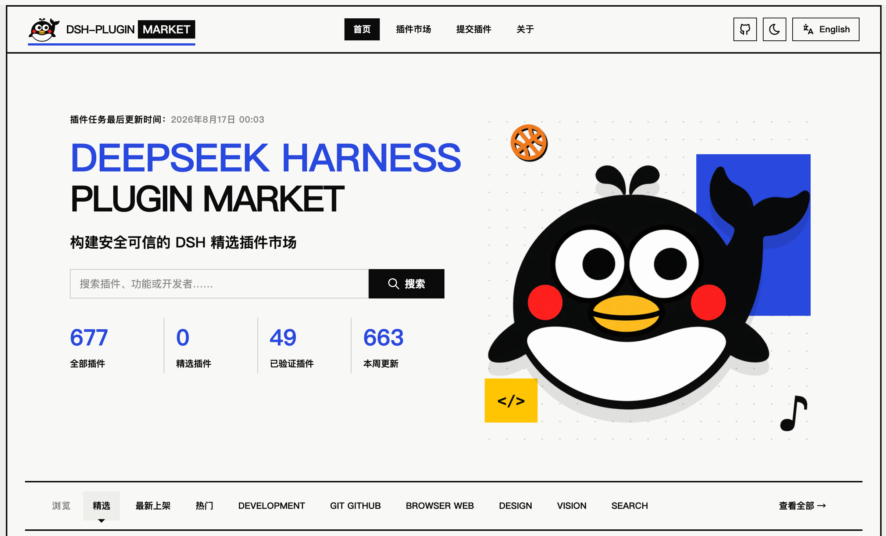

# DS Plugin Market

**English** | [简体中文](README.md)

> **Discover. Verify. Install with confidence.**
>
> A trustworthy plugin registry, discovery, and installation platform for the DeepSeek Harness ecosystem.

🌐 **https://ds-plugin.market**




> This project targets the DeepSeek Harness ecosystem. DeepSeek Harness is still in Developer Preview; plugin specs and compatibility rules may change quickly, and our scanner rules evolve with them.

---

## Why this project?

DeepSeek Harness is built around the idea that **Everything is a Plugin**. The official ecosystem currently uses the GitHub [`dsh-plugin`](https://github.com/topics/dsh-plugin) topic to help the community discover plugins.

But a GitHub topic can only answer:

> "Which repositories claim to be related to DSH Plugin?"

It cannot answer the questions that matter before you install:

- Is this repository **actually** a well-formed DSH Plugin / Bundle?
- Is it **compatible** with my current DSH / Cordis?
- Is it still being **maintained**?
- Will it run `prepare` / `postinstall` scripts at install time?
- What **security and supply-chain risks** should I care about?
- Which version / commit should I install to match the code the market scanned?

**DS Plugin Market is not just a view on top of the GitHub topic. It converts candidate repositories into a structured, verifiable, and traceable Plugin Registry.**

## Core value

### Discover

Continuously discover DSH plugin candidates from public sources such as GitHub, instead of maintaining a static hand-curated list.

### Verify

Automatically analyze the plugin structure, including:

- `package.json`
- `dsh.bundle.patch`
- `cordis.patch.yml`
- DSH / Cordis dependencies and peerDependencies
- Plugin entry / exports
- Node.js engine
- Client / Web platform metadata

Candidates progress through an explicit lifecycle:

```text
Candidate
   ↓
Detected
   ↓
Format Verified
   ↓
Featured (curated)
```

### Assess

Generate an independent Trust Profile for every plugin:

```text
Format Verification
Compatibility
Security Scan
Maintenance
Publisher Trust
```

For example:

```text
✓ Format Verified
✓ Compatible with current DSH baseline
⚠ prepare script detected
✓ Active maintenance
○ Publisher not verified
```

### Install with confidence

Scan results are bound to a concrete commit SHA. For GitHub installs we recommend pinning to the scanned commit:

```bash
dsh plugin --profile web add github:owner/repo#<scanned_commit_sha>
```

This way the code you install matches the scan results shown on the market.

## What does "Verified" mean?

This is one of the most important design principles of the project:

> **Format Verified ≠ Safe**

`Format Verified` only means the repository matches the structure rules the current Scanner understands for DSH Plugin / Bundle.

Security-related signals are surfaced independently, including:

- install scripts;
- dependency risk signals;
- shell / process execution;
- filesystem / network access patterns;
- dynamic code execution and other static risk signals;
- public vulnerability sources (to be integrated).

Even when the Security Scan finds no high-risk signals, it **does not mean** a third-party plugin is absolutely safe.

## Why are install scripts so important?

DeepSeek Harness supports installing plugins directly from GitHub:

```bash
dsh plugin --profile web add github:owner/repo
```

For Git dependencies that require a build step, authors often use a `prepare` script to generate artifacts. Allowing that script means third-party code executes during install.

That's why DS Plugin Market surfaces the following as first-class information:

```text
Install scripts
Build required
Scanned commit
Recommended pinned install
```

Rather than only showing Stars, Language, and License.

## Features (currently implemented)

### Registry MVP

- [x] GitHub `dsh-plugin` topic candidate discovery + incremental sync (SHA delta + ETag + rate-limit / 429 backoff)
- [x] D1 Registry (6 core tables + versioned migrations)
- [x] Scanner v1 pure functions: manifest / bundle / compatibility / security / maintenance / semver
- [x] Cron-triggered discovery + Cloudflare Queue async scanning (idempotency key `repo_id + sha + scanner_version`)
- [x] Public API + internal API (secret-guarded)
- [x] Home / Explore / Plugin Detail / Submit pages

### Trust Layer

- [x] DSH / Cordis compatibility baseline (synced from the npm registry, hourly cron, fallback to built-in baseline)
- [x] Install-script detection + static security signals + maintenance signals
- [x] Commit-bound scan history (Versions Tab + `GET /api/plugins/:owner/:repo/scans`)
- [x] Pinned-commit install command (InstallCard)

### Discovery Experience

- [x] Capability taxonomy + Plugin Type dimensions (shown on detail + used for filtering)
- [x] Advanced filters (capability / pluginType / compatibility / risk / verified / search / sort)
- [x] Featured (internal pinning API + home section) / Trending / New & Verified / Popular
- [x] Registry stats (`GET /api/stats`: candidates / verified / updated-this-week)
- [x] Publisher pages (`GET /api/publishers/:owner` + `/publisher/:owner`)
- [x] SEO / OpenGraph / Twitter meta
- [ ] AI Search (optional enhancement, deferred, non-blocking)

### Other

- [x] Bilingual i18n (zh-CN / en, auto-detected from browser)
- [x] Light / dark theme toggle (persisted, no flash on load)
- [x] Plugin preview images: GitHub Open Graph integration + scan-time backfill (README first-image fallback, commit-pinned)
- [x] Skeleton loading states

## How it works

```text
GitHub dsh-plugin Topic / Submit
              │
              ▼
        Candidate Discovery
              │
              ▼
       GitHub REST API
              │
      ┌───────┴────────┐
      │                │
      ▼                ▼
Repository         Commit / Tree
Metadata              Files
      │                │
      └───────┬────────┘
              ▼
        Static Scanner
              │
      ┌───────┼──────────┐
      ▼       ▼          ▼
   Format  Compatibility Security
      │       │          │
      └───────┼──────────┘
              ▼
        Trust Profile
              │
              ▼
      Cloudflare D1 Registry
              │
              ▼
        ds-plugin.market
```

Automatic update pipeline:

```text
Cloudflare Cron (hourly)
      ↓
Discover new / changed repos
      ↓
Cloudflare Queue
      ↓
Static Scan
      ↓
D1
```

The project does not fetch data by high-frequency crawling of GitHub HTML pages.

## Scanner safety boundary

v1.0 follows a single principle:

> **Never execute untrusted plugin code.**

The Scanner only reads and statically analyzes source / config via APIs. It never:

```text
npm install third-party repo
pnpm install third-party repo
run prepare / postinstall
execute plugin entry
execute repository shell scripts
```

Anything that cannot be determined statically is explicitly marked `Unknown`, never guessed as safe.

## Tech stack

```text
Frontend        React 19 + TypeScript + Vite 7 + Tailwind CSS 4 + daisyUI 5
API             Hono 4
Runtime         Cloudflare Workers
Registry        Cloudflare D1 (SQLite)
Scheduling      Cloudflare Cron Triggers (hourly)
Scan Jobs       Cloudflare Queues
Source          GitHub REST API
Test            Vitest (scanner / discovery / curation unit tests)
```

For detailed architecture, data model, scan rules, and milestone plans, see:

**[Technical Design v1.0](docs/TECHNICAL_DESIGN.md)** · **[Development Plan](docs/DEVELOPMENT_PLAN.md)** · **[Design Language](DESIGN.md)**

## Quick start

### Requirements

- Node.js 20+
- A Cloudflare account (not required for local D1 development; required for deploy)

### Local development

Install dependencies:

```bash
npm install
```

Configure local secrets (optional for browsing; required for discovery / scanning):

```bash
cp .dev.vars.example .dev.vars
```

Create and migrate the local D1 database:

```bash
wrangler d1 migrations apply DB --local
```

Start the dev server:

```bash
npm run dev
```

### Common scripts

```bash
npm run build        # tsc -b && vite build && scrub secrets from build output
npm run check        # type check + build + wrangler deploy --dry-run
npm run lint         # eslint
npm test             # vitest (scanner pure-function unit tests)
npm run cf-typegen   # regenerate worker-configuration.d.ts after changing bindings
npm run deploy       # deploy to Cloudflare Workers
```

> `GITHUB_TOKEN` and `INTERNAL_API_SECRET` are Worker secrets (locally via `.dev.vars`) and must never be committed to the repository or exposed to the frontend. Discovery and scanning need a GitHub Token; browsing the registry only needs the D1 database.

## Deployment (GitHub Actions)

Pushing to `main` triggers an automatic deploy via `.github/workflows/deploy.yml`. The workflow idempotently creates the Cloudflare Queue and D1 database, injects `database_id`, applies D1 migrations, and runs `wrangler deploy`.

Required GitHub repository secrets:

- `CLOUDFLARE_API_TOKEN` — a Cloudflare API token with **Workers Scripts: Edit**, **D1: Edit**, and **Workers Queues: Edit** permissions.
- `CLOUDFLARE_ACCOUNT_ID` — your Cloudflare account ID.

Worker runtime secrets (set once, never commit):

```bash
wrangler secret put GITHUB_TOKEN        # GitHub PAT used by the worker to call the GitHub API
wrangler secret put INTERNAL_API_SECRET # guards the /api/internal/* endpoints
```

## Contributing

We welcome all kinds of contributions: reporting issues, improving docs, refining scanner rules, adding frontend features, and more.

1. Fork this repository and create a feature branch.
2. Before coding, read the [Technical Design](docs/TECHNICAL_DESIGN.md) and the [Development Plan](docs/DEVELOPMENT_PLAN.md), and respect the Scanner safety boundary.
3. Run `npm run check` and `npm test` before submitting.
4. Open a Pull Request.

Core principle:

```text
GitHub = Source of Truth for Code

DS Plugin Market
= Source of Truth for Plugin Metadata & Trust Signals
```

We don't host plugins, duplicate third-party publishing systems, or try to replace GitHub / npm. Our job is:

> **GitHub tells you which repos claim to be DSH Plugins; DS Plugin Market tells you what they really are, whether they are compatible, and what you should know before installing.**

## Disclaimer

DS Plugin Market is a community project. It is not an official DeepSeek product and does not represent DeepSeek's review or endorsement of third-party plugins.

All Verification, Compatibility, and Security results are automated analyses tied to a specific scanner version, time, and commit. They are auxiliary information for installation decisions and do not replace source review or other security measures.

## Related links

- [DeepSeek Harness](https://github.com/deepseek-ai/deepseek-harness)
- [GitHub `dsh-plugin` Topic](https://github.com/topics/dsh-plugin)
- [DSH Plugin Tutorial](https://github.com/deepseek-ai/deepseek-harness/blob/master/docs/user/develop/basic/index.md)
- [DSH Package & Install Guide](https://github.com/deepseek-ai/deepseek-harness/blob/master/docs/user/develop/basic/publish.md)

## License

[MIT](LICENSE)

Copyright (c) 2026 0326
