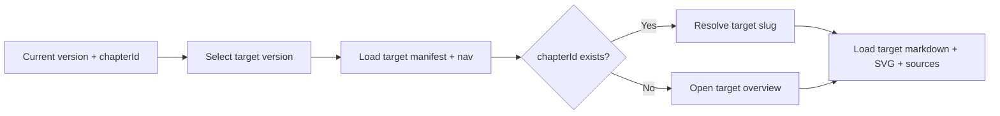
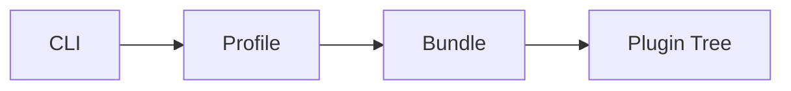
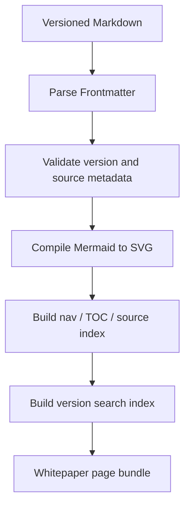
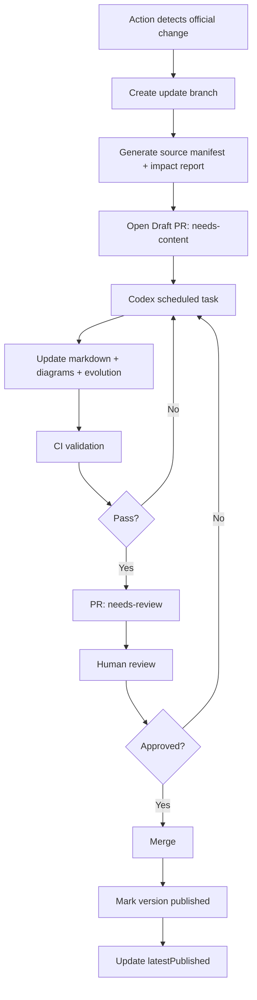
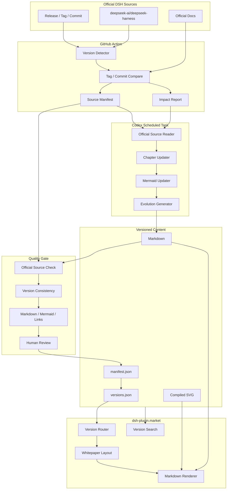

# DSH Living Whitepaper 技术方案

> 面向开发者的 DeepSeek Harness（DSH）版本化技术白皮书。
>
> 白皮书事实来源严格限定为 DeepSeek Harness 官方源码、官方文档、官方 Release / Tag / Commit。社区文章、第三方教程、搜索摘要不进入采集、生成、引用和校验链路。

- 所属项目：`0326/dsh-plugin-market`
- 上游事实源：`deepseek-ai/deepseek-harness`
- 产品形态：站内独立 Whitepaper 模块 + Markdown 内容库 + 完整版本快照 + 持续更新流水线
- 默认版本：最新**已验证并发布**的白皮书版本
- 开发版本：可选 `next`，绑定官方 `master` 的具体 Commit SHA
- 文档状态：Technical Plan v2

---

## 0. 本项目特点

本白皮书不是官方文档镜像，也不是一次性技术长文。它围绕“快速理解 DSH、准确定位源码、持续跟随版本”设计。

### 0.1 官方事实源唯一

所有架构结论、运行机制、接口说明和版本变化都必须能回溯到同一 DSH 版本的官方源码或官方文档。AI 只参与归纳、改写和结构化，不产生无官方依据的技术事实。

### 0.2 整体版本切换

每个 DSH Release 对应一套完整白皮书快照。切换版本时，目录、正文、架构图、源码链接、接口说明和版本演进同时切换，不采用“最新正文 + 局部旧版本补丁”的混合模式。

### 0.3 从全貌进入源码

内容按“全貌 → 机制 → 模块 → 接口 → 源码入口”组织。首页用于建立完整心智模型，模块页用于按需深入，不重复搬运完整 API Reference。

### 0.4 架构图是一等内容

复杂结构统一使用 Mermaid 源码维护，并构建为 SVG。架构图、时序图、状态图与正文一起版本化；不使用 ASCII / 文本线条图。

### 0.5 内容与工程共同版本化

Markdown、图、来源清单、版本 Manifest、校验结果均进入 Git。任一版本都可以定位到对应 DSH Tag / Commit 和白皮书修订记录。

### 0.6 持续生成而非持续手工维护

GitHub Action 负责版本检测、Diff、影响分析输入、校验和 PR 编排；Codex 定时任务负责读取官方材料并生成或修订正文与 Mermaid；最终通过 CI 和 Review 发布。更新链路既能自动运行，也保留明确的人审门禁。

---

## 1. 目标

白皮书解决四个问题：

1. **快速建立全貌**：先理解 DSH 的组成、边界和关键概念，再按模块进入源码级说明。
2. **理解运行机制**：完整说明 DSH 从启动、Profile 组装、Agent 创建、Turn / Step、LLM、Tool、Session Event 到 UI 投影的运行链路。
3. **理解开放能力**：说明 Plugin、Service、Event、Capability Seam、Preset、Hooks、Client Slot、SDK 等扩展面，以及各扩展点的适用范围。
4. **保持版本一致**：每个支持版本是一套完整内容快照，可独立阅读、验证、引用和回滚。

白皮书提供开发者认知路径和源码导航，不替代官方 API Reference。

---

## 2. 核心原则

### 2.1 官方事实源唯一

允许作为事实依据的来源只有：

- `github.com/deepseek-ai/deepseek-harness` 下的源码；
- 同仓库 `docs/`、`packages/**/README*`、`.agents/notes/implemented/**` 等官方维护内容；
- 同仓库 Release、Tag、Commit、Compare；
- DeepSeek Harness 官方文档站，且内容可回溯到官方仓库。

不允许：

- 社区白皮书；
- 博客、论坛、公众号等二次资料；
- 第三方 DSH 教程；
- 搜索结果摘要；
- 无法定位到官方版本的转述。

### 2.2 版本一致性优先于内容复用

每个版本拥有完整内容快照。任何页面在当前版本不存在时：

- 不读取其他版本正文；
- 不复用其他版本架构图；
- 不复用其他版本源码链接；
- 返回当前版本首页或对应上级章节，并提示该章节在此版本不存在。

### 2.3 面向阅读，不面向展示

正文要求：

- 先定义，再说明机制，再给接口和源码入口；
- 一个段落只表达一个主题；
- 图、表、接口、调用链优先；
- 不使用对话式铺垫和无信息量总结；
- 不为了完整重复官方 Reference；
- 不用不准确类比换取“易懂”；
- 复杂结构使用 Mermaid / SVG。

### 2.4 可验证

每篇 Markdown 必须声明：

- DSH 版本；
- 官方 Tag / Commit SHA；
- 官方来源；
- 内容状态；
- 白皮书修订号；
- 最后验证时间。

### 2.5 AI 不直接决定发布

AI 可以生成正文、图、摘要和迁移说明，但不能绕过：

- 官方来源约束；
- 版本一致性校验；
- Markdown / Mermaid 构建校验；
- 内容状态门禁；
- PR Review。

---

## 3. 产品信息架构

主站顶部导航新增独立菜单：

**白皮书 / Whitepaper**

Whitepaper 不放入现有 Docs 二级目录。现有 Docs 面向插件市场使用说明；Whitepaper 面向 DSH 架构、运行机制和插件开发。

### 3.1 路由

| 路由 | 含义 |
|---|---|
| `/whitepaper` | 跳转到最新已发布白皮书版本 |
| `/whitepaper/latest` | 最新已发布版本别名 |
| `/whitepaper/next` | 官方 master 开发快照 |
| `/whitepaper/:version` | 指定版本首页 |
| `/whitepaper/:version/:slug` | 指定版本章节 |
| `/whitepaper/versions` | 版本列表 |

Canonical URL 始终使用明确版本：

`/whitepaper/v0.1.5-alpha.1/runtime`

`latest` 仅用于导航，不作为长期 canonical。

### 3.2 白皮书目录

| 章节 | 目标 |
|---|---|
| 00. DSH 全貌 | 15 分钟建立完整心智模型 |
| 01. Cordis 与组合模型 | Context、Plugin、Service、Inject、Event、Effect |
| 02. 启动与配置组装 | CLI、Profile、Bundle、Patch、Plugin Tree |
| 03. Agent Core | Session、System Prompt、Tools、Agent、Agent Loop |
| 04. 运行机制 | Inbox、Turn、Step、Request、Stream、Tool、Stop |
| 05. Session 与状态 | Event Log、Projection、Persistence、Fork、Migration |
| 06. Capability Seam | Definition、Provider、Consumer 与替换边界 |
| 07. 核心能力模块 | LLM、FS、Shell、Terminal、LSP、Skill、Web、Sandbox 等 |
| 08. Preset 与 Agent 组装 | per-session preset、scope、persona、tool presentation |
| 09. Subagent / Workflow / Jobs | 多 Agent、工作流、后台任务 |
| 10. Hooks 与拦截 | Agent / Tool events、Claude Code / Codex hooks |
| 11. Web 架构 | Host、RPC、Client Model、UI Slot、Conversation |
| 12. 插件开发 | 插件结构、依赖、生命周期、调试、发布 |
| 13. 扩展能力地图 | Tool / Provider / UI / Prompt / Command / Persistence 等 |
| 14. SDK / ACP / Webhook | 外部系统接入 |
| 15. 安全与权限 | Interaction、Approval、Permission、Sandbox、Guard |
| 16. 调试与观测 | Config dump、Session log、diagnostics、事件定位 |
| 17. 版本演进 | 当前版本相对上一支持版本的结构与 API 变化 |

首页展示核心学习路径和全景架构，不把全部章节平铺成长列表。

---

## 4. 版本模型

### 4.1 完整版本快照

```text
content/whitepaper/
  source-registry.json
  upstream-map.yml
  versions.json
  v0.1.3-alpha.2/
    manifest.json
    nav.json
    00-overview.md
    ...
    17-evolution.md
  v0.1.5-alpha.1/
    manifest.json
    nav.json
    00-overview.md
    ...
  next/
    manifest.json
    nav.json
    ...
```

### 4.2 上游最新版本与白皮书最新版本分离

不能在检测到新 DSH Release 后立即修改 `/whitepaper/latest`。

`versions.json` 同时记录：

- `upstreamLatest`：官方已检测到的最新 Release；
- `latestPublished`：白皮书已经验证并发布的最新版本。

```json
{
  "upstreamLatest": "v0.1.6-alpha.1",
  "latestPublished": "v0.1.5-alpha.1",
  "versions": [
    {
      "id": "v0.1.6-alpha.1",
      "status": "drafting"
    },
    {
      "id": "v0.1.5-alpha.1",
      "status": "published"
    }
  ]
}
```

只有 `published` 版本可以成为 `latestPublished`。

### 4.3 版本生命周期

```text
detected
  -> preparing
  -> drafting
  -> review
  -> verified
  -> published
```

异常状态：

- `blocked`：官方材料不足、构建失败或存在未处理 Breaking Change；
- `superseded`：开发态 `next` 已被正式 Release 替代。

### 4.4 Manifest

```json
{
  "version": "v0.1.5-alpha.1",
  "upstreamRepo": "deepseek-ai/deepseek-harness",
  "upstreamTag": "dsh-v0.1.5-alpha.1",
  "upstreamCommit": "<sha>",
  "whitepaperRevision": 2,
  "status": "published",
  "verifiedAt": "2026-09-10T00:00:00Z",
  "sourcePolicy": "official-only"
}
```

DSH 版本和白皮书修订号分离。修正文案时增加 `whitepaperRevision`，不改变绑定的上游 Tag / Commit。

### 4.5 稳定 Chapter ID

章节使用稳定 `chapterId`，slug 只负责 URL：

```yaml
---
chapter_id: runtime
slug: runtime
title: Agent 运行机制
order: 4
dsh_version: v0.1.5-alpha.1
upstream_tag: dsh-v0.1.5-alpha.1
upstream_commit: <sha>
status: verified
verified_at: 2026-09-10
sources:
  - id: architecture
    path: docs/architecture.zh.md
  - id: lifecycle
    path: docs/agent-lifecycle.md
  - id: agent-loop
    path: packages/core/agent-loop/README.zh.md
---
```

版本切换以 `chapterId` 查找目标版本对应页面。这样即使某个版本更改 slug，仍能跳到同一概念章节。

---

## 5. 版本切换机制

切换过程：

1. 当前页面解析为 `version + chapterId`；
2. 用户选择目标版本；
3. 读取目标版本 `nav.json`；
4. 根据 `chapterId` 找目标 slug；
5. 存在则加载目标版本完整页面资产；
6. 不存在则进入目标版本首页并提示该模块在该版本尚不存在；
7. 不进行任何跨版本正文 fallback。



浏览器可以记录最近使用版本，但明确版本 URL 始终优先。

---

## 6. 内容渲染架构

### 6.1 Markdown 技术栈

当前项目继续使用 React + Vite，不引入独立文档框架。

建议增加：

- `react-markdown`：Markdown → React；
- `remark-gfm`：GFM；
- `remark-frontmatter`：Frontmatter；
- `gray-matter`：构建期读取 Metadata；
- `rehype-slug`：标题锚点；
- `rehype-autolink-headings`：标题链接；
- `shiki`：代码高亮；
- Mermaid 构建工具：将 fenced Mermaid 转换为 SVG；
- `minisearch`：P1 版本内全文搜索。

Markdown 不开启任意 HTML 直通。

### 6.2 Mermaid 构建为 SVG

Markdown 仍以 Mermaid 作为图的源码：

````markdown

````

推荐在构建阶段解析 Mermaid 并生成 SVG，而不是在页面运行时加载完整 Mermaid Runtime。

收益：

- 首屏更轻；
- 图无需等待客户端二次渲染；
- 静态预渲染和 SEO 更稳定；
- SVG 可以直接放大、复制和缓存；
- Mermaid 语法错误在 CI 阶段暴露。

允许图类型：

- `flowchart`：架构、数据流；
- `sequenceDiagram`：运行时序；
- `stateDiagram-v2`：状态模型；
- `classDiagram`：接口关系；
- `gitGraph`：版本演进。

不使用 Mermaid 默认视觉主题。构建阶段注入 Whitepaper Light / Dark Theme Variables，并保留必要的响应式属性。

### 6.3 构建产物

```text
src/generated/whitepaper/
  versions.generated.json
  nav.generated.json
  content-manifest.generated.json
  search-index/
  diagrams/
```

构建流程：



正文按当前版本、当前章节懒加载，不把所有历史版本打进首屏 Bundle。

---

## 7. 前端模块设计

```text
src/react-app/
  pages/
    Whitepaper.tsx
    WhitepaperVersions.tsx
  components/whitepaper/
    WhitepaperLayout.tsx
    WhitepaperSidebar.tsx
    WhitepaperHeader.tsx
    VersionSelector.tsx
    MarkdownRenderer.tsx
    Diagram.tsx
    CodeBlock.tsx
    TableOfContents.tsx
    OfficialSources.tsx
    VersionNotice.tsx
  lib/
    whitepaper.ts
  whitepaper.css
```

### 7.1 Router

扩展现有轻量 Router，不引入 React Router：

```ts
| { name: "whitepaper"; version: string; slug?: string }
| { name: "whitepaper-versions" }
```

### 7.2 Layout

桌面端采用三栏：

- 左侧：章节导航；
- 中间：正文；
- 右侧：本页目录 + 官方来源；
- 顶部：Whitepaper 标识 + 版本选择器 + 当前版本状态。

正文宽度控制在 `760–820px`。

移动端：

- 左侧目录进入 Drawer；
- 右侧 TOC 折叠为“本页目录”；
- 版本切换始终可见；
- 超宽 SVG 支持横向滚动和全屏查看。

---

## 8. 视觉与阅读规范

Whitepaper 复用主站 Header、Theme、语言基础设施和 Footer，但使用独立阅读主题。

### 8.1 字体与排版

不额外引入大型字体资源。优先使用系统字体栈：

- 正文：`-apple-system, BlinkMacSystemFont, "Segoe UI", "PingFang SC", "Microsoft YaHei", sans-serif`；
- 章节大标题：`ui-serif, "Songti SC", "STSong", serif`；
- Code：系统等宽字体。

规范：

- 正文 16–18px；
- 中文行高约 1.75；
- 正文最大宽度 760–820px；
- H1 / H2 层级明确，不做营销式大标题；
- 表格保留足够行距；
- 代码块、接口和图是主要视觉信息。

### 8.2 视觉语言

采用 Editorial / Technical Manual 风格：

- 大留白；
- 细分隔线；
- 低对比辅助文字；
- 固定 Note / Warning / Version Change 语义样式；
- 不堆 Dashboard 卡片；
- 不使用大面积渐变、高饱和背景和装饰 Badge。

### 8.3 页面结构

模块型章节优先采用：

1. 定义
2. 架构位置
3. 解决的问题
4. 运行机制
5. 核心接口 / Event / Service
6. 与其他模块的关系
7. 扩展方式
8. 源码入口
9. 当前版本变化
10. 官方来源

没有内容的部分直接省略，不为模板完整度填充文字。

---

## 9. 内容写作规范

### 9.1 写法

每节开头用 1–2 句给出定义或结论，随后直接进入机制、图和接口。

示例：

> `Agent Loop` 是 DSH 默认的 Agent Driver，负责推进 Turn / Step 生命周期，并协调 Request、LLM Stream、Tool Execution 和 Session Event 的提交。

### 9.2 禁止写法

避免：

- “让我们先来理解一下”；
- “你可以把它想象成”；
- “简单来说”反复出现；
- “这就是 DSH 强大的地方”；
- 无官方依据的优劣评价；
- 同义反复；
- 为了易懂引入不准确类比；
- 总结型空话和宣传文案。

### 9.3 信息密度

- 一般段落不超过 4 句；
- 模块边界优先用表格；
- 调用链优先用时序图；
- API 只展示理解机制所需的签名；
- 细节通过源码入口继续深入。

---

## 10. 官方来源追踪

### 10.1 Source Registry

```json
{
  "repositories": [
    "deepseek-ai/deepseek-harness"
  ],
  "officialDocs": [
    "https://deepseek-harness.github.io/deepseek-harness/"
  ]
}
```

CI 拒绝其他仓库或 Host 作为白皮书事实来源。

### 10.2 固定版本

Release 页面中的源码链接必须指向：

- 对应 Release Tag；或
- Manifest 中的 Commit SHA。

禁止正式版本正文引用浮动 `master`。

`next` 可以跟踪官方 `master`，但每次快照必须记录精确 SHA。

### 10.3 Source Manifest

不需要把整个 DSH 仓库复制进本站。每个版本生成 `source-manifest.json`，记录实际引用文件及其 Blob SHA：

```json
{
  "upstreamCommit": "<sha>",
  "files": [
    {
      "path": "docs/architecture.zh.md",
      "blob": "<blob-sha>"
    }
  ]
}
```

这样可以验证来源没有漂移，同时避免维护上游源码副本。

### 10.4 章节级引用

Frontmatter 给出章节全部官方来源；关键定义、Breaking Change 和 API 行为可以使用 source id 做节级引用。渲染器统一生成固定 Tag / SHA 链接，正文不手写浮动 GitHub URL。

---

## 11. GitHub Action + Codex 内容生成闭环

更新链路分成三个职责层：

1. **GitHub Action：工程编排**；
2. **Codex 定时任务：内容生成与修订**；
3. **CI + Review：验证与发布**。

### 11.1 GitHub Action 负责什么

`.github/workflows/whitepaper-upstream-sync.yml`

建议：

- Release 检查：每 6 小时；
- `next` / master 检查：每天或按实际更新频率调整；
- 支持手动触发。

Action 只处理确定性的工程任务：

- 检测官方 Release / Tag / Commit；
- 获取 Tag Compare；
- 扫描 package / docs / API 文件变化；
- 根据 Impact Map 标记受影响章节；
- 创建新版本目录和 Manifest；
- 生成 `impact.json` / `source-manifest.json`；
- 创建或更新 Draft PR；
- 运行来源、版本、Markdown、Mermaid、链接校验；
- 构建预览站点。

Action 不负责写技术正文。

### 11.2 Codex 定时任务负责什么

Codex 定时任务周期性检查带指定 Label 的 Whitepaper Draft PR，例如：

`whitepaper:needs-content`

读取输入仅限：

- 当前版本官方 Tag / Commit；
- 上一支持版本官方 Tag / Commit；
- `impact.json`；
- 当前白皮书版本内容；
- `source-registry.json` 和 `upstream-map.yml`。

任务负责：

- 判断变化是否影响已有架构描述；
- 更新受影响正文；
- 新增 / 删除能力说明；
- 更新 Mermaid 图；
- 生成版本演进章节；
- 更新 Frontmatter sources；
- 对复制自上一版本的章节重新验证；
- 执行内容校验；
- 将结果提交到 Draft PR 分支。

生成规则写成仓库内固定 Prompt / Skill，不依赖临时聊天上下文。

建议新增：

```text
.agents/whitepaper/
  WRITING_RULES.md
  SOURCE_POLICY.md
  UPDATE_PLAYBOOK.md
  REVIEW_CHECKLIST.md
```

### 11.3 PR 状态机



### 11.4 为什么分两层自动化

Action 擅长检测、Diff、构建、校验和 PR 生命周期；正文生成需要理解多个官方文件之间的语义关系，应由具备代码库阅读能力的 Agent 完成。两者通过 Git 分支、Manifest、Impact Report 和 PR 状态交接，不把生成逻辑塞进 CI 脚本。

---

## 12. Impact Map 与变化分析

维护：

`content/whitepaper/upstream-map.yml`

```yaml
chapters:
  runtime:
    - docs/architecture*.md
    - docs/agent-lifecycle*.md
    - packages/core/agent-loop/**
    - packages/core/agent/**
  session:
    - packages/core/session/**
    - packages/session/**
    - docs/subsystems/session*.md
  web-client:
    - packages/client/**
    - packages/host/**
    - docs/subsystems/web-client*.md
```

Action 先通过路径映射生成候选影响集；Codex 再做语义判断。

`impact.json` 建议记录：

```json
{
  "from": "dsh-v0.1.5-alpha.1",
  "to": "dsh-v0.1.6-alpha.1",
  "changedFiles": [],
  "candidateChapters": [],
  "releaseNotes": [],
  "breakingCandidates": []
}
```

Impact Map 是加速器，不是事实判断器。未命中映射的新目录、新包仍必须进入“未归类变化”列表，防止新增架构能力被漏掉。

---

## 13. 新版本生成策略

新 Release 出现后：

1. Action 创建新版本完整目录；
2. 复制上一版本正文，所有章节状态改为 `needs-verification`；
3. 固定新 Tag / Commit；
4. 生成官方 Tag Compare、Source Manifest 和 Impact Report；
5. Codex 重新验证每章来源；
6. 受影响章节更新正文和 Mermaid；
7. 新能力增加新章节或扩展现有章节；
8. 删除能力在对应版本正文中删除，并记录到 Evolution；
9. 生成版本演进章节；
10. 所有章节状态达到 `verified`；
11. CI 全量通过；
12. Review 后发布。

即使源码路径未变化，复制章节也不能直接视为 verified。接口语义可能因依赖、配置或上层生命周期变化而改变。

---

## 14. 版本演进章节

`17-evolution.md` 只描述当前版本相对上一**白皮书支持版本**发生的变化。

来源限定为：

- 官方 Release Notes；
- 官方 Tag Compare；
- 官方源码和官方文档。

分类：

- Architecture
- Runtime
- Plugin API
- Session Format
- Capability
- Web / UI
- SDK / ACP
- Security / Permission
- Breaking Changes

每项变化回答：

1. 变了什么；
2. 影响哪个模块 / API；
3. 插件开发者是否需要迁移。

版本演进页不替代完整版本切换。

---

## 15. 搜索设计

P1 增加全文搜索：

- 默认只搜索当前版本；
- 可显式选择全部版本；
- 结果始终显示版本；
- 当前版本优先；
- 不混入插件市场 Guide、README 或社区内容；
- 每个版本独立索引。

搜索结果跳转到明确版本 URL，不使用 `latest`。

---

## 16. SEO 与静态可读性

Whitepaper 是长期技术内容，不能只依赖客户端渲染后才可抓取。

要求：

- 每个版本章节有稳定 URL；
- 独立 title / description / canonical；
- `latest` canonical 指向明确版本；
- sitemap 收录最新 published 版本全部章节；
- 历史版本保持可访问，但默认 `noindex,follow`，减少高度相似内容重复收录；
- 版本列表页允许索引；
- Whitepaper 页面支持构建期 prerender。

P0 可以先完成客户端渲染；P1 增加 prerender，不单独引入完整 SSR 框架。

---

## 17. 国际化

第一阶段：

- 中文为主；
- Package、Service、Event、Interface 名保持官方英文；
- 官方源码标识符不翻译；
- 不因现有全站语言切换阻塞首版。

后续英文版使用独立正文：

```text
content/whitepaper/v0.1.5-alpha.1/zh/...
content/whitepaper/v0.1.5-alpha.1/en/...
```

同语言版本共享 Manifest、Source Manifest 和版本状态，不共享正文。

---

## 18. 与现有 dsh-plugin.market 集成

当前站点已有：

- React + Vite；
- 自定义轻量 Router；
- Guide / Trust 文档区域；
- 独立页面 CSS；
- 明暗主题；
- 中英文基础设施；
- Cloudflare Worker 部署。

Whitepaper 复用 Header / Theme / Router / 部署基础设施，不直接复用 `DocsLayout`。

原因：

- Whitepaper 有 15+ 章节和多级目录；
- 需要全局版本切换；
- 需要右侧 TOC 和官方来源；
- 需要版本状态；
- 阅读排版与插件市场功能页不同。

---

## 19. 系统架构



边界：

- Official Sources 决定事实；
- Action 负责确定性工程工作；
- Codex 负责基于官方事实生成内容；
- CI 负责机器可验证约束；
- Review 决定是否发布；
- Renderer 不参与事实转换。

---

## 20. 校验与质量门禁

### 20.1 工程校验

新增：

```text
scripts/whitepaper/
  build-content.mjs
  validate-content.mjs
  compile-diagrams.mjs
  sync-upstream.mjs
  diff-upstream.mjs
  build-search-index.mjs
```

`validate-content.mjs` 至少检查：

- Frontmatter 必填字段；
- `chapterId` 唯一；
- 页面版本与目录一致；
- upstream Tag / Commit 与 Manifest 一致；
- Source Host / Repo 在 Allowlist；
- Source Path 在对应 Tag 中存在；
- Source Blob 与 Source Manifest 一致；
- Release 页面不存在 `master` 事实链接；
- 不存在跨版本 include；
- Mermaid 可构建；
- 内链存在；
- Nav 与 Markdown 一致；
- `latestPublished` 指向 published 版本；
- 不存在社区来源 citation。

### 20.2 内容门禁

发布版本要求：

- 所有必选章节状态为 `verified`；
- 所有 Breaking Change 已归类；
- 所有未归类上游变化已处理或明确标记为不影响白皮书；
- Evolution 与 Tag Compare 一致；
- 关键 API / 行为有官方来源；
- 不包含无依据推断。

### 20.3 视觉测试

覆盖：

- Overview；
- 大型架构图；
- Sequence Diagram；
- 长代码块；
- 宽表格；
- 版本切换；
- Mobile Sidebar；
- Dark Mode。

---

## 21. 实施阶段

### P0：Whitepaper 阅读框架

完成：

- 顶部新增“白皮书”菜单；
- `/whitepaper/:version/:slug` 路由；
- `WhitepaperLayout`；
- 版本选择器；
- Markdown 渲染；
- Mermaid → SVG；
- Shiki 代码块；
- 左侧章节树 + 右侧 TOC；
- 官方来源区；
- Version Manifest；
- Content Validator。

验收：站内可完整阅读一个 DSH 版本，切换版本不会串用内容。

### P1：第一版高质量白皮书

优先完成：

1. DSH 全貌；
2. Cordis 与组合模型；
3. 启动与 Profile / Bundle；
4. Agent Core；
5. Agent 运行机制；
6. Session；
7. Capability Seam；
8. 插件开发；
9. Web / Slot；
10. 版本演进。

同时完成版本内搜索和 Whitepaper prerender。

### P2：Living Whitepaper 闭环

完成：

- Upstream Sync Action；
- Release / master 检测；
- Tag Compare；
- Source Manifest；
- Impact Map；
- Draft PR 自动创建；
- Codex 定时内容更新任务；
- PR Label / 状态机；
- 自动校验和预览；
- 发布后自动更新 `latestPublished`。

### P3：长期能力

可选：

- 英文版；
- 两版本章节 Diff；
- 官方源码符号级跳转；
- Package / Service / Event 自动索引；
- 图谱化 Capability Map；
- 架构图 SVG 导出。

---

## 22. 首版不做

第一阶段不做：

- 镜像官方全部 API Reference；
- 社区教程聚合；
- 用户在线编辑白皮书；
- WYSIWYG 编辑器；
- 运行时实时读取 GitHub Markdown；
- 每次访问查询 upstream；
- 跨版本正文 fallback；
- 未 Review 的自动正文直接发布；
- 由 GitHub Action 脚本直接生成技术正文。

---

## 23. 推荐目录

```text
content/
  whitepaper/
    source-registry.json
    upstream-map.yml
    versions.json
    v0.1.5-alpha.1/
      manifest.json
      source-manifest.json
      nav.json
      00-overview.md
      01-cordis.md
      ...
      17-evolution.md
    next/
      ...

.agents/
  whitepaper/
    WRITING_RULES.md
    SOURCE_POLICY.md
    UPDATE_PLAYBOOK.md
    REVIEW_CHECKLIST.md

src/react-app/
  pages/
    Whitepaper.tsx
    WhitepaperVersions.tsx
  components/whitepaper/
    WhitepaperLayout.tsx
    WhitepaperSidebar.tsx
    WhitepaperHeader.tsx
    VersionSelector.tsx
    MarkdownRenderer.tsx
    Diagram.tsx
    CodeBlock.tsx
    TableOfContents.tsx
    OfficialSources.tsx
    VersionNotice.tsx
  lib/
    whitepaper.ts
  whitepaper.css

src/generated/whitepaper/
  versions.generated.json
  nav.generated.json
  content-manifest.generated.json
  diagrams/
  search-index/

scripts/whitepaper/
  build-content.mjs
  validate-content.mjs
  compile-diagrams.mjs
  sync-upstream.mjs
  diff-upstream.mjs
  build-search-index.mjs

.github/workflows/
  whitepaper-upstream-sync.yml
```

---

## 24. 技术决策摘要

| 议题 | 决策 |
|---|---|
| 信息源 | 只允许 DSH 官方源码 / 文档 / Release / Tag / Commit |
| 内容模型 | 每个 DSH 版本一套完整 Markdown 快照 |
| 版本切换 | `chapterId` 对齐，目录、正文、图、来源整体切换 |
| 最新版本 | 区分 `upstreamLatest` 与 `latestPublished` |
| 开发版本 | `next` 绑定官方 master 的具体 SHA |
| Markdown | `react-markdown + remark/rehype` |
| 架构图 | Mermaid 源码，构建期编译 SVG |
| 代码高亮 | Shiki |
| Layout | 新建 `WhitepaperLayout` |
| 阅读风格 | Editorial / Technical Manual |
| 工程同步 | GitHub Action 检测 / Diff / Manifest / PR / CI |
| 内容更新 | Codex 定时任务读取官方源并修订 Markdown / Mermaid |
| 发布 | CI 全量通过 + Human Review 后发布 |
| 来源追踪 | Source Registry + Source Manifest + 固定 Tag / SHA |
| 搜索 | 每版本独立索引 |
| SEO | 最新 published 版本索引，历史版本默认 noindex |

核心目标是在 `dsh-plugin.market` 内形成一套 **官方事实可追溯、完整版本可切换、正文适合开发者阅读、能够持续生成与验证的 DSH Living Whitepaper 系统**。
