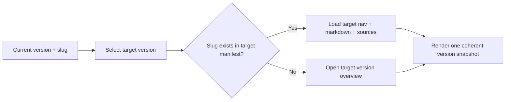
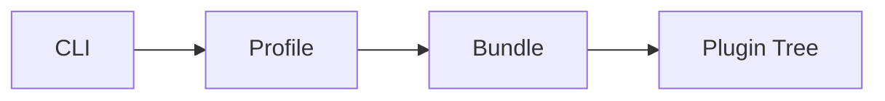
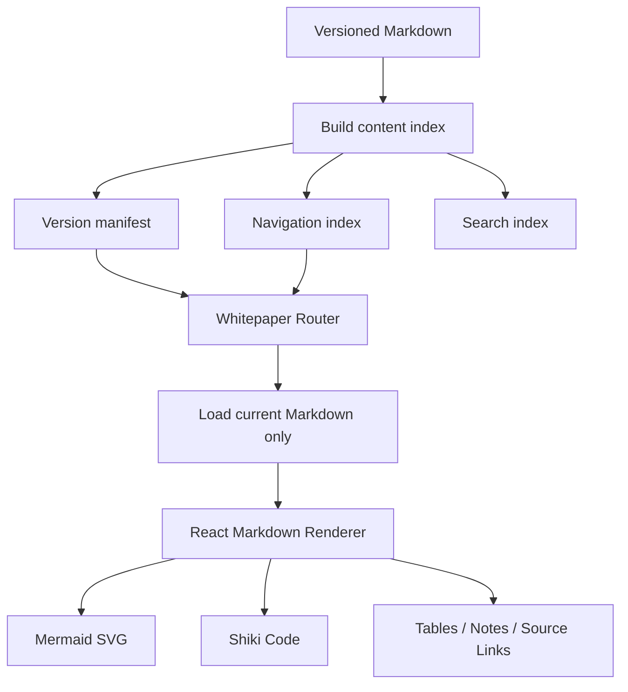
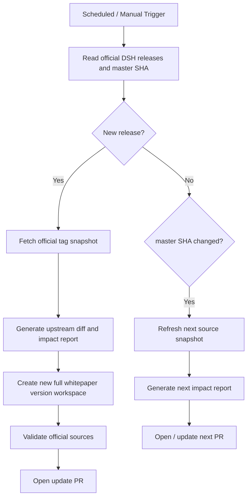
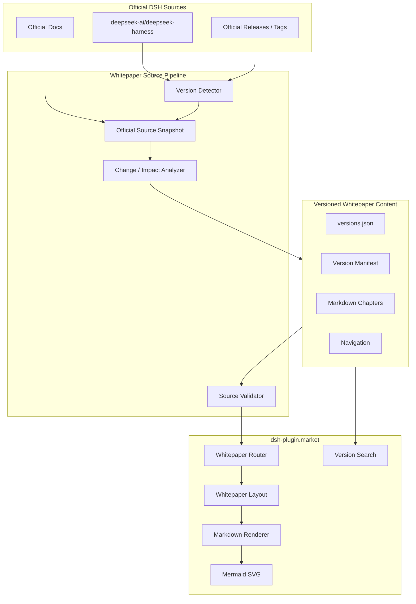

# DSH Living Whitepaper 技术方案

> 面向开发者的 DeepSeek Harness（DSH）版本化技术白皮书。
>
> 本方案只定义白皮书产品与工程实现。白皮书的事实来源严格限定为 DeepSeek Harness 官方源码、官方文档、官方 Release / Tag / Commit，不使用社区文章、社区教程或第三方二次解读作为内容来源。

- 所属项目：`0326/dsh-plugin-market`
- 上游事实源：`deepseek-ai/deepseek-harness`
- 形态：站内独立 Whitepaper 模块 + Markdown 内容仓库 + 版本快照 + 官方源同步流水线
- 默认版本：最新已发布 DSH Release
- 开发版本：可选 `next`，固定到官方 `master` 的具体 commit SHA
- 文档状态：Technical Plan v1

---

## 1. 目标

白皮书解决四个问题：

1. **快速建立全貌**：先理解 DSH 的组成、边界和关键概念，再按模块进入源码级说明。
2. **理解运行机制**：完整说明 DSH 从启动、Profile 组装、Agent 创建、Turn / Step、LLM、Tool、Session Event 到 UI 投影的运行链路。
3. **理解开放能力**：说明 Plugin、Service、Event、Capability Seam、Preset、Hooks、Client Slot、SDK 等扩展面，以及各扩展点的适用范围。
4. **保持版本一致**：每个 DSH Release 对应完整白皮书快照。切换版本后，目录、正文、架构图、源码链接、API 说明、版本演进全部切换到同一版本。

白皮书不是 DSH 官方文档的镜像，也不逐页翻译官方文档。它提供开发者需要的结构化认知路径，并且每一个技术事实都能回到对应版本的官方材料验证。

---

## 2. 核心原则

### 2.1 官方事实源唯一

允许作为事实依据的来源只有：

- `github.com/deepseek-ai/deepseek-harness` 下的源码；
- 同仓库 `docs/`、`packages/**/README*`、`.agents/notes/implemented/**` 等官方维护内容；
- 同仓库 Release、Tag、Commit、Compare；
- DeepSeek Harness 官方文档站，且内容可回溯到上述官方仓库。

不允许：

- 社区白皮书；
- 博客、知乎、公众号、论坛；
- 第三方 DSH 教程；
- 搜索结果摘要；
- 无法定位到官方版本的二次转述。

社区内容可以帮助发现问题，但不能进入白皮书的采集、生成、引用和校验链路。

### 2.2 版本一致性优先于内容复用

白皮书不采用“公共正文 + 局部版本差异”的模型。每个版本拥有一套完整内容快照。

任何页面在当前版本不存在时：

- 不从其他版本读取正文；
- 不显示其他版本的架构图；
- 不复用其他版本源码链接；
- 明确提示“该章节在此版本尚不存在”，并提供该版本目录入口。

### 2.3 面向阅读，不面向展示

正文要求：

- 先给定义，再给机制，再给接口和源码入口；
- 一个段落只表达一个主题；
- 优先图、表、接口和调用链，减少重复解释；
- 避免“我们来看看”“可以想象成”“简单来说”“本质上就是”等对话式、AI 式铺垫；
- 不为了完整而重复官方 API Reference；
- 不使用 ASCII / 文本线条架构图；
- 复杂结构统一使用 Mermaid 或正式图片资源。

### 2.4 可验证

每篇 Markdown 必须声明：

- DSH 版本；
- 官方 Tag / Commit SHA；
- 官方来源文件；
- 白皮书内容修订号；
- 最后验证时间。

CI 校验来源、版本和正文之间的一致性。

---

## 3. 产品信息架构

主站顶部导航新增独立菜单：

**白皮书 / Whitepaper**

不归入现有“文档 / Docs”二级目录。现有 Docs 面向插件市场使用说明；Whitepaper 面向 DSH 架构与开发者学习，两者信息边界不同。

建议路由：

| 路由 | 含义 |
|---|---|
| `/whitepaper` | 跳转到最新已发布版本首页 |
| `/whitepaper/latest` | 最新已发布版本别名 |
| `/whitepaper/next` | 官方 master 开发快照，可选 |
| `/whitepaper/:version` | 指定版本首页 |
| `/whitepaper/:version/:slug` | 指定版本章节 |
| `/whitepaper/versions` | 版本列表与发布时间 |

推荐 canonical URL 始终使用明确版本：

`/whitepaper/v0.1.5-alpha.1/architecture`

`latest` 只负责解析当前最新版本，不作为长期 canonical 地址。

### 3.1 白皮书目录

第一版建议固定为以下主目录。版本变化时允许章节增删，但同一版本目录必须自洽。

| 章节 | 目标 |
|---|---|
| 00. DSH 全貌 | 15 分钟建立完整心智模型 |
| 01. Cordis 与组合模型 | Context、Plugin、Service、Inject、Event、Effect |
| 02. 启动与配置组装 | CLI、Profile、Bundle、Patch、Plugin Tree |
| 03. Agent Core | Session、System Prompt、Tools、Agent、Agent Loop |
| 04. 运行机制 | Inbox、Turn、Step、Request、Stream、Tool、Stop |
| 05. Session 与状态 | Durable Event Log、Projection、Persistence、Fork、Migration |
| 06. Capability Seam | Definition、Provider、Consumer 与替换边界 |
| 07. 核心能力模块 | LLM、FS、Shell、Terminal、LSP、Skill、Web、Sandbox 等 |
| 08. Preset 与 Agent 组装 | per-session preset、scope、persona、tool presentation |
| 09. Subagent / Workflow / Jobs | 多 Agent、工作流和后台任务 |
| 10. Hooks 与拦截 | Agent / Tool events、Claude Code / Codex hooks |
| 11. Web 架构 | Host、RPC、Client Model、UI Slot、Conversation |
| 12. 插件开发 | 插件结构、依赖、生命周期、调试、发布 |
| 13. 扩展能力地图 | Tool / Provider / UI / Prompt / Command / Persistence 等 |
| 14. SDK / ACP / Webhook | 外部系统接入方式 |
| 15. 安全与权限 | Interaction、Approval、Permission、Sandbox、Guard |
| 16. 调试与观测 | Config dump、Session log、diagnostics、事件定位 |
| 17. 版本演进 | 当前版本相对上一版本的结构与 API 变化 |

首页只展示核心路径，不把全部章节一次性展开为长列表。

---

## 4. 版本模型

### 4.1 版本是完整内容快照

每个版本使用独立目录：

```text
content/whitepaper/
  versions.json
  v0.1.3-alpha.2/
    manifest.json
    nav.json
    00-overview.md
    01-cordis.md
    02-boot.md
    ...
    17-evolution.md
  v0.1.5-alpha.1/
    manifest.json
    nav.json
    00-overview.md
    ...
  next/
    manifest.json
    nav.json
    ...
```

`versions.json` 只保存版本索引：

```json
{
  "latest": "v0.1.5-alpha.1",
  "versions": [
    {
      "id": "v0.1.5-alpha.1",
      "tag": "dsh-v0.1.5-alpha.1",
      "commit": "<official-sha>",
      "releasedAt": "2026-09-08",
      "status": "release"
    }
  ]
}
```

### 4.2 Manifest

每个版本必须有 `manifest.json`：

```json
{
  "version": "v0.1.5-alpha.1",
  "upstreamRepo": "deepseek-ai/deepseek-harness",
  "upstreamTag": "dsh-v0.1.5-alpha.1",
  "upstreamCommit": "<sha>",
  "whitepaperRevision": 1,
  "verifiedAt": "2026-09-10T00:00:00Z",
  "sourcePolicy": "official-only"
}
```

DSH version 和白皮书修订号分离。修正文案错误时可以增加 `whitepaperRevision`，但不能改变该版本绑定的上游 commit。

### 4.3 页面 Frontmatter

```yaml
---
title: Agent 运行机制
slug: runtime
order: 4
dsh_version: v0.1.5-alpha.1
upstream_tag: dsh-v0.1.5-alpha.1
upstream_commit: <sha>
verified_at: 2026-09-10
sources:
  - path: docs/architecture.zh.md
  - path: docs/agent-lifecycle.md
  - path: packages/core/agent-loop/README.zh.md
---
```

来源链接由渲染层根据 `upstream_tag` 自动拼成固定版本 GitHub URL，正文作者不手写 master 链接。

---

## 5. 版本切换机制

版本选择器固定在 Whitepaper Header 中。

切换逻辑：

1. 当前 URL 为 `/whitepaper/vA/runtime`；
2. 用户切换到 `vB`；
3. 路由尝试进入 `/whitepaper/vB/runtime`；
4. 若 `runtime` 在 vB 存在，加载 vB 的正文、目录、来源、架构图；
5. 若不存在，进入 `/whitepaper/vB`，并提示该章节在 vB 不存在；
6. 禁止任何跨版本正文 fallback。



浏览器可记录用户最近使用版本，但从外部打开明确版本 URL 时，以 URL 为准。

---

## 6. 内容渲染架构

### 6.1 技术选型

当前项目为 React + Vite，白皮书继续使用现有前端工程，不引入独立文档框架。

建议增加：

- `react-markdown`：Markdown → React；
- `remark-gfm`：表格、任务列表、脚注等 GFM；
- `remark-frontmatter`：识别 Frontmatter；
- `gray-matter`：构建期读取 metadata；
- `rehype-slug`：标题锚点；
- `rehype-autolink-headings`：标题链接；
- `mermaid`：Markdown 内架构图；
- `shiki`：代码高亮；
- `minisearch`：可选，P1 用于版本内全文搜索。

不启用任意 HTML 直通。Markdown 中的 HTML 默认不执行，减少 XSS 和样式污染。

### 6.2 Markdown 架构图

架构图统一使用 Mermaid fenced code：

````markdown

````

渲染为 SVG，不显示原始文本线条图。

允许的图类型：

- `flowchart`：架构和数据流；
- `sequenceDiagram`：Turn / Step / Tool 调用链；
- `stateDiagram-v2`：Session / Agent 状态；
- `classDiagram`：核心接口关系；
- `gitGraph`：版本演进，仅在表达确有价值时使用。

Mermaid 使用单独的 Whitepaper Theme Variables，跟随站点明暗主题。图支持：

- 点击放大；
- 横向滚动兜底；
- SVG 清晰缩放；
- 移动端自适应；
- 复制 Mermaid 源码；
- 可选下载 SVG。

### 6.3 加载方式

Vite 构建时使用 `import.meta.glob` 收集：

`content/whitepaper/**/*.md`

构建阶段生成：

```text
src/generated/whitepaper/
  versions.generated.json
  nav.generated.json
  search-index.generated.json
```

运行时只加载当前版本当前章节，避免把所有版本 Markdown 打入首屏 bundle。



---

## 7. 前端模块设计

建议新增：

```text
src/react-app/
  pages/
    Whitepaper.tsx
    WhitepaperVersions.tsx
  components/whitepaper/
    WhitepaperLayout.tsx
    WhitepaperSidebar.tsx
    WhitepaperHeader.tsx
    VersionSelector.tsx
    MarkdownRenderer.tsx
    MermaidDiagram.tsx
    CodeBlock.tsx
    TableOfContents.tsx
    OfficialSources.tsx
    VersionNotice.tsx
  lib/
    whitepaper.ts
  whitepaper.css
```

### 7.1 路由

扩展现有轻量 Router，不引入 React Router。

新增 Route：

```ts
| { name: "whitepaper"; version: string; slug?: string }
| { name: "whitepaper-versions" }
```

路由解析由 `versions.generated.json` 校验合法版本和 slug。

### 7.2 Layout

桌面端采用三栏：

- 左侧：章节导航；
- 中间：正文；
- 右侧：当前页目录 / 官方来源；
- 顶部：白皮书标题、版本选择器、当前版本状态。

正文宽度控制在约 `760–820px`，避免沿用插件市场卡片式高密度布局。

移动端：

- 左侧目录收进 Drawer；
- 右侧 TOC 收进“本页目录”；
- 版本切换始终可见；
- Mermaid 超宽图允许横向滚动和全屏查看。

---

## 8. 视觉与阅读规范

Whitepaper 与主站共享：

- 顶部品牌 Header；
- 明暗主题；
- 语言切换基础设施；
- 全站导航和 Footer。

Whitepaper 内部使用独立阅读主题：

### 8.1 排版

- 正文：16–18px，中文行高约 1.75；
- 正文最大宽度：760–820px；
- H1 / H2 有明显层级，但减少大面积装饰；
- 中文正文优先系统无衬线字体；
- 大标题可使用开源中文衬线字体的精简子集，形成与主站的轻度区分；
- Code 使用等宽字体；
- 表格保留足够行距，默认不做密集数据表样式。

### 8.2 视觉语言

避免：

- 大面积营销渐变；
- Dashboard 式卡片堆叠；
- 过多 Badge；
- 高饱和背景；
- ASCII 架构图；
- Mermaid 默认主题直接裸用。

推荐：

- Editorial / Technical Manual 风格；
- 大留白；
- 细分隔线；
- 低对比辅助文字；
- 代码、接口、架构图作为主要视觉信息；
- Note / Warning / Version Change 只使用少量固定语义样式。

### 8.3 页面固定结构

模块型章节尽量采用统一结构：

1. 定义
2. 解决的问题
3. 架构位置
4. 运行机制
5. 核心接口 / Event / Service
6. 与其他模块的关系
7. 扩展方式
8. 源码入口
9. 当前版本变化
10. 官方来源

不是每页强制十段；无信息的段落直接省略，不填充模板化文字。

---

## 9. 内容写作规范

白皮书需要“深入浅出”，但不使用对话式解释。

### 9.1 推荐写法

定义：

> `Agent Loop` 是 DSH 默认的 Agent Driver，负责推进 Turn / Step 生命周期，并协调 Request、LLM Stream、Tool Execution 和 Session Event 的提交。

随后直接进入生命周期图和接口关系。

### 9.2 禁止写法

避免：

- “让我们先来理解一下……”；
- “你可以把它想象成……”；
- “简单来说……”连续出现；
- “这就是 DSH 强大的地方”；
- 无依据的优劣评价；
- 同义反复；
- 为了显得易懂而引入不准确类比。

### 9.3 信息密度

- 每节开头 1–2 句给结论；
- 一般段落不超过 4 句；
- 能用表格说明模块边界时，不写长段落；
- 能用时序图说明调用链时，不重复写完整步骤列表；
- API 只展示理解机制所需的关键签名；
- 细节通过“源码入口 / 官方来源”继续深入。

---

## 10. 官方来源追踪与校验

### 10.1 Source Registry

新增：

```text
content/whitepaper/source-registry.json
```

记录允许的上游：

```json
{
  "repositories": [
    "deepseek-ai/deepseek-harness"
  ],
  "officialDocs": [
    "https://deepseek-harness.github.io/deepseek-harness/"
  ]
}
```

CI 不接受其他 source host / repository。

### 10.2 Pin 到版本

所有 GitHub 源码链接必须指向：

- Release Tag；或
- 对应 Manifest 的 commit SHA。

禁止白皮书发布页引用 `master` 作为 release 版本事实依据。

`next` 是唯一允许绑定 `master` 的通道，但实际仍保存同步时的精确 commit SHA。

### 10.3 校验脚本

新增：

```text
scripts/whitepaper/
  build-content.mjs
  validate-content.mjs
  sync-upstream.mjs
  diff-upstream.mjs
  build-search-index.mjs
```

`validate-content.mjs` 至少检查：

- Frontmatter 必填字段；
- 页面 DSH version 与目录版本一致；
- upstream tag / commit 与 manifest 一致；
- source repository 在 allowlist；
- source path 在对应官方 tag 中真实存在；
- 不存在跨版本 include；
- Mermaid syntax 可解析；
- 内部链接目标存在；
- release 页面无 `master` 源链接；
- 页面不存在社区来源链接作为 citation。

---

## 11. 官方更新同步机制

白皮书同时跟踪两个官方变化面：

1. **Release / Tag**：产生新的可切换正式白皮书版本；
2. **master / 官方文档更新**：更新 `next`，提前识别架构变化。

### 11.1 更新流水线

新增 GitHub Action：

`.github/workflows/whitepaper-upstream-sync.yml`

建议每 6 小时检查一次，也支持手动触发。



### 11.2 自动化边界

允许自动完成：

- 检测 Release / Tag / Commit；
- 获取官方文件；
- 生成两个版本的源码 diff；
- 生成 package / service / event / tool 变化清单；
- 创建新版本目录骨架；
- 复制未受影响章节作为“待验证副本”；
- 标记受影响章节；
- 运行来源校验；
- 创建 PR。

不直接自动 merge 白皮书正文。

原因：DSH 当前处于快速演进阶段，源码变化可能改变概念边界。仅根据文件 diff 自动改写正文容易产生语义漂移。

### 11.3 Impact Map

维护：

`content/whitepaper/upstream-map.yml`

示例：

```yaml
chapters:
  runtime:
    - docs/architecture*.md
    - docs/agent-lifecycle*.md
    - packages/core/agent-loop/**
    - packages/core/agent/**
  session:
    - packages/core/session/**
    - packages/session/**
    - docs/subsystems/session*.md
  web-client:
    - packages/client/**
    - packages/host/**
    - docs/subsystems/web-client*.md
```

上游变更后先通过路径映射得到受影响章节，再做语义 Review。

---

## 12. 新版本生成策略

新 Release 出现时，不从空白开始，也不直接复用旧版本运行时内容。

流程：

1. 创建新版本完整目录；
2. 复制上一版本内容，状态统一改为 `needs-verification`；
3. 对比官方两个 Tag；
4. 根据 Impact Map 标记章节：
   - `unchanged-source`
   - `source-changed`
   - `new-capability`
   - `removed-capability`
   - `breaking-change`
5. 逐章重新绑定新版本 official source；
6. 受影响章节更新正文和 Mermaid；
7. 未受影响章节也必须通过新 Tag 的 source existence 校验；
8. 生成“版本演进”章节；
9. 全量校验；
10. Review 后发布。

因此“完整版本快照”不会导致每次全量重写，同时避免运行时跨版本拼接。

---

## 13. 版本演进章节

每个版本的 `17-evolution.md` 只描述：

**当前版本相对上一白皮书支持版本发生了什么。**

信息来源限定为：

- 官方 Release Notes；
- 官方 Tag Compare；
- 官方源码 / 文档变化。

按影响分类：

- Architecture
- Runtime
- Plugin API
- Session Format
- Capability
- Web / UI
- SDK / ACP
- Security / Permission
- Breaking Changes

每个变化尽量回答三件事：

1. 变了什么；
2. 影响哪个模块 / API；
3. 插件开发者是否需要迁移。

版本演进页不替代完整版本切换。要查看旧机制，直接切换到旧版本阅读完整章节。

---

## 14. 搜索设计

P1 增加 Whitepaper 全文搜索。

规则：

- 默认只搜索当前版本；
- 可以显式选择“全部版本”；
- 搜索结果明确显示版本；
- 当前版本结果优先；
- 不把插件市场 README、Guide、社区内容混入白皮书知识搜索。

构建时为每个版本生成独立索引，避免搜索结果跨版本污染。

---

## 15. SEO 与静态可读性

Whitepaper 是长期技术内容，不应只依赖客户端交互后才可发现。

最低要求：

- 每个版本章节有稳定 URL；
- 独立 title / description / canonical；
- sitemap 收录最新版本全部章节；
- 历史版本保留可访问 URL；
- `latest` 不与 canonical 产生重复索引；
- 页面 Heading、正文和来源在无 JS 情况下至少应有可抓取退化方案。

如果现有站点继续保持 SPA，P1 建议对白皮书路由增加构建期 prerender；不为白皮书单独引入完整 SSR 框架。

---

## 16. 国际化策略

第一阶段建议：

- 中文作为主白皮书；
- 技术标识符、Service、Event、Package 名保持官方英文；
- 官方英文源码名不翻译；
- 不为了现有全站语言切换而阻塞首版。

后续英文版采用独立 Markdown：

```text
content/whitepaper/v0.1.5-alpha.1/zh/...
content/whitepaper/v0.1.5-alpha.1/en/...
```

不同语言共享同一 `manifest` 和官方来源，不共享正文。

---

## 17. 与现有 dsh-plugin.market 的集成

当前站点已有：

- 自定义轻量 Router；
- `DocsLayout`；
- Guide / Trust 文档区域；
- 独立页面 CSS；
- 全站明暗主题；
- 中英文切换；
- Cloudflare Worker 部署。

Whitepaper 复用基础设施，但不直接复用 `DocsLayout`。

原因：

- Docs 当前侧栏规模小；
- Whitepaper 有 15+ 章节、多级目录和版本切换；
- Whitepaper 需要右侧 TOC、Source、版本状态；
- 阅读排版应与插件市场功能页保持明显区分。

建议新增 `WhitepaperLayout`，只复用 Header / Theme / I18n / Router 基础能力。

---

## 18. 架构边界



核心边界：

- Official Sources 决定事实；
- Content 层决定开发者如何理解这些事实；
- Renderer 不承担技术事实转换；
- 版本选择发生在 Content 层之前，避免跨版本混合。

---

## 19. 测试与质量门禁

### 19.1 单元测试

覆盖：

- route parse；
- version resolution；
- latest alias；
- slug existence；
- Markdown metadata；
- source URL generation；
- TOC generation；
- Mermaid component error boundary。

### 19.2 内容测试

每次 PR：

- 所有版本 manifest 可解析；
- nav 与 Markdown 一一对应；
- 当前版本无跨版本引用；
- source path 在官方 tag 中存在；
- Mermaid 可解析；
- 内链无 404；
- `latest` 指向真实版本；
- evolution 的 previous version 存在；
- 禁止社区来源 citation。

### 19.3 视觉测试

重点页面：

- Overview；
- 大型 Mermaid 架构图；
- Sequence Diagram；
- 长代码块；
- 宽表格；
- 版本切换；
- mobile sidebar；
- dark mode。

---

## 20. 实施阶段

### P0：Whitepaper 阅读框架

完成：

- 顶部新增“白皮书”菜单；
- `/whitepaper/:version/:slug` 路由；
- WhitepaperLayout；
- 版本选择器；
- Markdown 渲染；
- Mermaid SVG；
- Shiki 代码块；
- 左侧章节树 + 右侧 TOC；
- 官方来源区；
- 第一版版本目录结构；
- content validator。

验收：可以在站内阅读一个完整 DSH 版本，版本切换没有内容串用。

### P1：第一版高质量白皮书

优先完成：

1. DSH 全貌；
2. Cordis 与组合模型；
3. 启动与 Profile / Bundle；
4. Agent Core；
5. Agent 运行机制；
6. Session；
7. Capability Seam；
8. 插件开发；
9. Web / Slot；
10. 版本演进。

其余章节随后补齐。

### P2：Living Whitepaper

完成：

- upstream sync Action；
- Release 检测；
- `next` 检测；
- Tag Diff；
- Impact Map；
- 自动创建版本目录；
- 自动生成更新 PR；
- 版本内搜索。

### P3：长期能力

可选：

- 构建期 prerender；
- 英文版；
- 架构图 SVG 下载；
- 两版本章节 Diff；
- 官方源码符号级跳转；
- Package / Service / Event 自动索引。

---

## 21. 首版不做

第一阶段不做：

- 把官方全部 API Reference 搬进市场站；
- 社区教程聚合；
- 用户编辑白皮书；
- 在线 WYSIWYG 编辑器；
- 运行时从 GitHub 拉 Markdown 后直接渲染；
- 每次访问实时读取 upstream；
- 跨版本内容 fallback；
- 未 Review 的自动正文直接发布。

内容应在仓库内版本化，构建时进入站点，保证可审查、可回滚、可追踪。

---

## 22. 推荐最终目录

```text
content/
  whitepaper/
    source-registry.json
    upstream-map.yml
    versions.json
    v0.1.5-alpha.1/
      manifest.json
      nav.json
      00-overview.md
      01-cordis.md
      ...
      17-evolution.md
    next/
      ...

src/react-app/
  pages/
    Whitepaper.tsx
    WhitepaperVersions.tsx
  components/whitepaper/
    WhitepaperLayout.tsx
    WhitepaperSidebar.tsx
    WhitepaperHeader.tsx
    VersionSelector.tsx
    MarkdownRenderer.tsx
    MermaidDiagram.tsx
    CodeBlock.tsx
    TableOfContents.tsx
    OfficialSources.tsx
  lib/
    whitepaper.ts
  whitepaper.css

src/generated/whitepaper/
  versions.generated.json
  nav.generated.json

scripts/whitepaper/
  build-content.mjs
  validate-content.mjs
  sync-upstream.mjs
  diff-upstream.mjs
  build-search-index.mjs

.github/workflows/
  whitepaper-upstream-sync.yml
```

---

## 23. 技术决策摘要

| 议题 | 决策 |
|---|---|
| 信息源 | 只允许 DSH 官方源码 / 文档 / Release / Tag / Commit |
| 内容模型 | 每个 DSH 版本一套完整 Markdown 快照 |
| 版本切换 | URL 驱动，全目录、正文、图、来源整体切换 |
| 最新版本 | `/whitepaper/latest` 解析后使用明确版本 canonical |
| 开发版本 | 可选 `next`，固定官方 master commit SHA |
| Markdown | `react-markdown + remark/rehype` |
| 架构图 | Mermaid → SVG，禁止 ASCII 架构图 |
| 代码高亮 | Shiki |
| Layout | 新建 WhitepaperLayout，不复用现有 DocsLayout |
| 阅读风格 | Editorial / Technical Manual，正文窄栏，高可读性 |
| 上游同步 | GitHub Action 定时检测官方 Release + master |
| 自动更新 | 自动 diff / impact / PR，不直接自动 merge 正文 |
| 质量门禁 | Source pin、版本一致性、Mermaid、内链、来源 allowlist |
| 搜索 | P1/P2 版本内独立索引 |

该方案的核心不是增加一个 Markdown 页面，而是在 `dsh-plugin.market` 内建立一套 **官方事实可追溯、版本完全隔离、适合长期阅读和持续演进的 DSH Developer Whitepaper 系统**。
