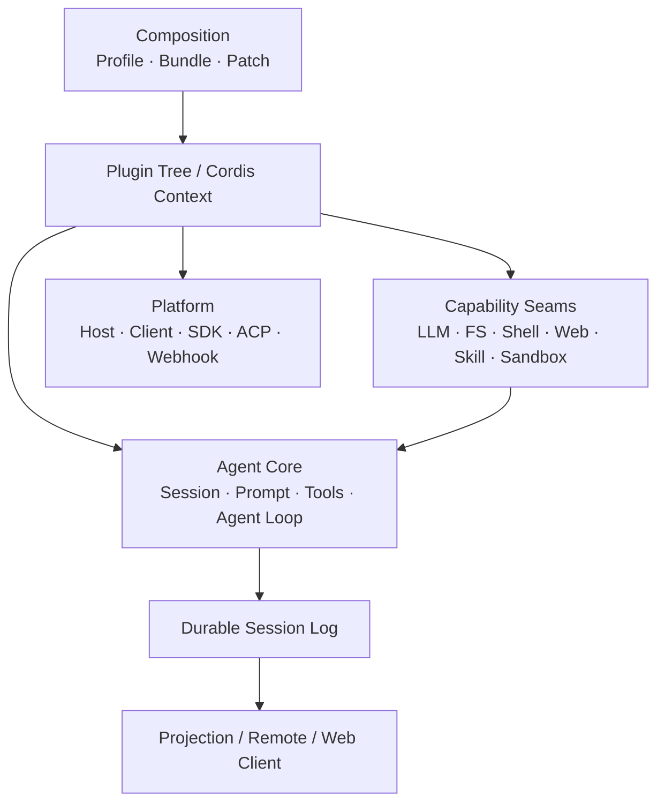

# DSH 全貌

DeepSeek Harness（DSH）是一个开源 Agent Harness。当前架构建立在 Cordis 之上，产品能力通过插件组合形成；模型适配器、Tool Registry、Session Log、Agent Loop 等都处在可替换的插件树中。

> 本白皮书按 DSH Release 固定内容。本页对应 `dsh-v0.1.5-alpha.1`，上游 Commit 为 `5dda764e`。

## 一张图看清 DSH

DSH 的结构可以分成四个面：

| 层 | 负责什么 | 典型模块 |
| --- | --- | --- |
| 组合层 | 决定启动时挂载哪些插件 | Profile、Bundle、Patch、Cordis Context |
| Agent 主干 | 推进一次对话并沉淀持久事实 | Session、System Prompt、Tools、Agent、Agent Loop |
| 能力层 | 向 Agent 提供可替换能力 | LLM、FS、Shell、Terminal、Web、Skill、Subagent、Sandbox |
| 产品层 | 把 Agent 暴露给不同运行形态 | Web、Headless、SDK、ACP、Desktop |

## 先掌握五个概念

**Plugin** 是组合单位。插件向共享 Context 注册 Service、Event Listener 或其他 Effect；插件卸载时，对应注册会随生命周期撤销。

**Profile** 描述一次 DSH 应用启动使用的组合。官方当前提供 `web`、`headless`、`sdk`、`sdk-minimal`、`acp` 等 Profile。

**Agent** 是运行中的 Agent 句柄；默认驱动实现由 `agent-loop` 提供，但扩展插件面向公开 Agent API，而不是绑定具体驱动器。

**Session Event Log** 是持久事实层。模型可见历史从日志派生，Turn、Step、用户消息、助手消息与 Tool 结果均围绕这条数据主线组织。

**Capability Seam** 把能力拆成 Definition、Provider、Consumer。替换 Provider 可以改变同一能力在整个组合中的具体实现，而 Consumer 不需要直接依赖实现包。

## 阅读路径

第一次阅读按以下顺序即可：

1. **Cordis 与组合模型**：理解 DSH 如何被组装出来。
2. **Agent 运行机制**：理解一条用户消息怎样进入模型、调用 Tool 并沉淀日志。
3. **插件开发与扩展面**：确定新增能力应该挂在哪个 seam 或 event 上。

P0 先建立阅读框架与核心章节。完整模块拆解、Session、Web Client、Preset、Sandbox、SDK/ACP 等章节在 P1 补齐。
