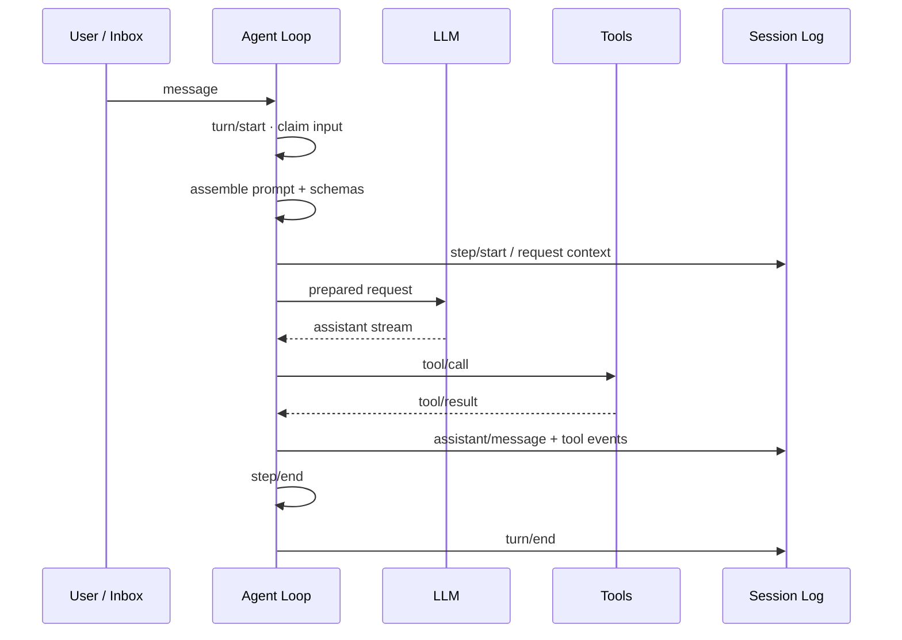

# Agent 运行机制

DSH 把一次用户交互组织为 Turn，把一次模型请求及其 Tool Calls 组织为 Step。一个 Turn 可以包含零个或多个 Step，直到当前工作不再欠下一次模型请求。

## 主链路

## Turn 与 Step

`turn/start` 在本轮第一次输入被认领后开始。Agent Loop 组装系统 Prompt 和 Tool Schemas，再经过 `agent/pre-step`、`agent/request` 等扩展点准备实际模型调用。

每次模型请求进入一个 Step：

1. `step/start`；
2. 准备并冻结当前模型历史；
3. 流式执行 LLM Request；
4. 若模型发出 Tool Call，进入 Tool Execution Pipeline；
5. 结果写回 Session Event Log；
6. `step/end`。

如果 Tool Result 或新输入要求继续请求模型，同一 Turn 进入下一个 Step；否则执行 `agent/turn-stopping` 并结束 Turn。

## Tool 执行不是直接函数调用

Tool Call 会经过统一执行流水线：

`tools/pre-execute` → `tools/execute` → `tools/post-execute`

这些事件允许权限、Hook、Guard、Telemetry 等能力在不修改 Agent Loop 的情况下参与执行。需要拦截 Tool 时应优先进入该流水线，而不是修改具体 Tool 实现或 Agent Loop。

## Model-visible means logged

官方架构要求：进入模型请求的内容必须能够从 Session Log 重建。模型历史由持久事件投影得到，而不是依赖仅存在于进程内存的隐藏上下文。

这条规则把恢复、Fork、Transcript、Telemetry 与模型上下文统一到同一份 durable facts 上。新增模型可见输入时，需要先明确它如何进入 Session Event 或被已有事件稳定派生。
