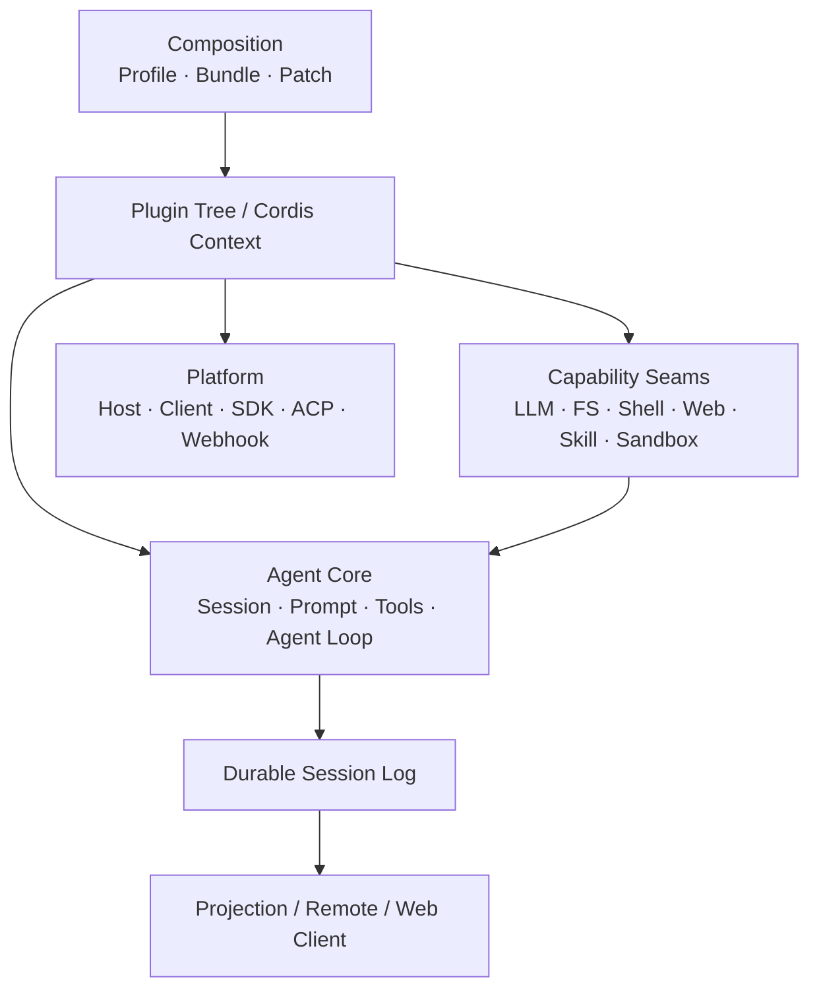

# DSH 全貌

DeepSeek Harness（DSH）是一个开源 Agent Harness。它建立在 Cordis 之上，产品能力通过插件组合形成；模型适配器、Tool Registry、Session Log、Agent Loop 等都处在可替换的插件树中。

> 本页固定于 `dsh-v0.1.5-rc.1`，上游 Commit 为 `183f08e9`。白皮书中的目录、正文、架构图和源码链接均以该版本为准。

## 一张图看清 DSH

DSH 的结构可以分成四个面：

| 层 | 负责什么 | 典型模块 |
| --- | --- | --- |
| 组合层 | 决定启动时挂载哪些插件 | Profile、Bundle、Patch、Cordis Context |
| Agent 主干 | 推进一次对话并沉淀持久事实 | Session、System Prompt、Tools、Agent、Agent Loop |
| 能力层 | 向 Agent 提供可替换能力 | LLM、FS、Shell、Terminal、Web、Skill、Subagent、Sandbox |
| 产品层 | 把 Agent 暴露给不同运行形态 | Web、Headless、SDK、ACP、Desktop |

## 先掌握五个概念

**Plugin** 是组合单位。插件向共享 Context 注册 Service、Event Listener 或其他 Effect；插件卸载时，对应注册随生命周期撤销。

**Profile** 描述一次 DSH 应用启动使用的组合。该版本随发行版提供 `web`、`headless`、`sdk`、`sdk-minimal`、`acp` 等 Profile 模板。

**Agent** 是运行中的公开句柄。默认驱动由 `agent-loop` 提供，扩展插件面向 `ctx.agents` 与 `Agent` 接口，不直接绑定驱动实现。

**Session Event Log** 是持久事实层。模型历史由日志派生；Turn、Step、用户消息、助手消息与 Tool 结果均围绕这条数据主线组织。rc.1 中持久化写路径由生命周期持有的 `SessionHandle` 管理，并通过写所有权避免同一 Session 被多个进程同时恢复写入。

**Capability Seam** 把能力拆成 Definition、Provider、Consumer。Provider 可以在组合层替换，Consumer 依赖稳定接口而不是具体实现。

## 应用如何被组装

运行中的 DSH 是一棵启动时按层叠加得到的 Plugin Tree。官方 `web`、`headless`、`sdk`、`acp` 以 `dsh-base` 为共享基础层，`sdk-minimal` 则拥有一套独立的完整配置树。

配置层按顺序应用：Profile 中的 Bundle → Profile Patch → Harness Home Patch → `--patch` Overlay。更高层可以按 Row ID 替换已有配置或插入新配置。

## 阅读路径

第一次阅读建议按以下顺序：

1. **Cordis 与组合模型**：理解 DSH 如何被组装出来。
2. **Agent 运行机制**：理解一条输入怎样进入 Turn / Step、模型、Tool 与 Session Log。
3. **插件开发与扩展面**：确定新增行为应该进入哪个 Service、Event、Tool 或 UI Slot。

P0 先覆盖上述核心链路。Session、Web Client、Preset、Subagent、Workflow、Sandbox、SDK/ACP 等完整模块拆解在后续章节补齐。
