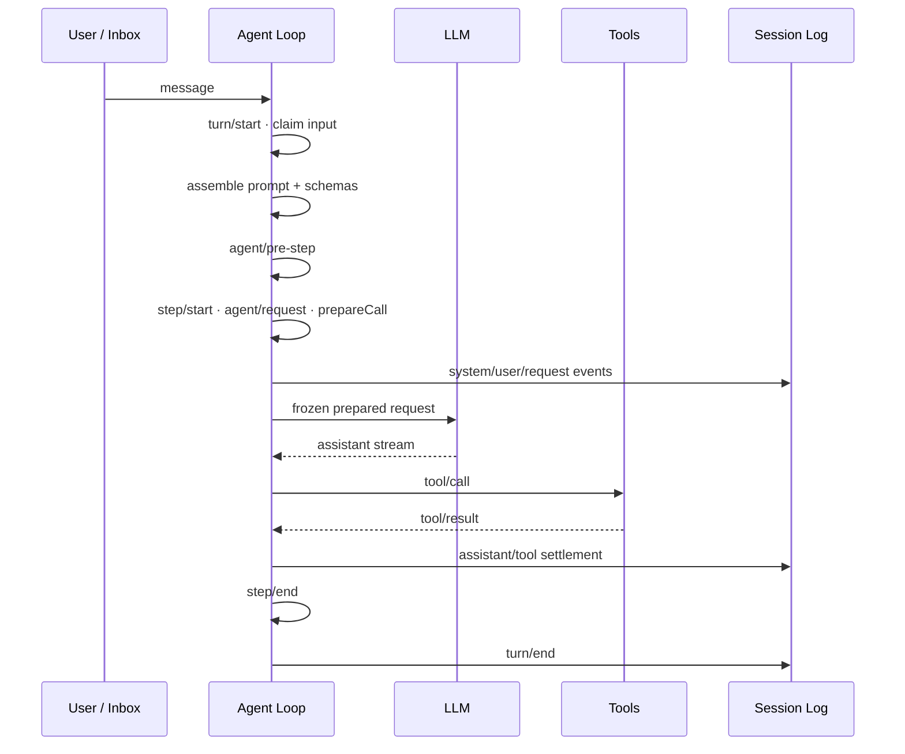

# Agent 运行机制

DSH 把一次连续工作组织为 Turn，把一次模型请求及其 Tool Calls 组织为 Step。一个 Turn 可以包含零个或多个 Step，直到当前工作不再需要下一次模型请求。

## 主链路

## Turn 与 Step

在轮次边界，驱动器打开持久 Turn，并从 Inbox 原子领取下一步输入和一条排队消息。随后组装 Prompt、Tool Schemas 和 Runtime Context，并执行 `agent/pre-step`。

输入被接纳后才进入 Step。一次 Step 的核心顺序是：

1. 记录 `step/start`；
2. 执行 `agent/request` 与 `prepareCall()`，解析实际模型路由；
3. 按模型能力协调 `system/message`，首次尝试追加已接纳的 `user/message`；
4. 从 Session Log 派生并冻结模型请求；
5. 流式执行模型请求；
6. 执行模型产生的 Tool Calls；
7. 提交 `assistant/message`、`assistant/attempt` 和 Tool 事件；
8. 记录 `step/end`。

如果 Tool Result 或下一步输入仍要求模型继续处理，同一 Turn 进入下一个 Step；否则执行 `agent/turn-stopping`，最后提交 `turn/end`。

## 请求提交与取消边界

`agent/request` 和 `prepareCall()` 位于系统提示词与用户消息正式提交之前。任一阶段发生取消，都不会把这一轮待接纳的 System/User 内容写入模型历史。

每次真正请求模型前，Agent Loop 从 Session Log 派生消息，并冻结请求对象。重试复用同一份已渲染的组装结果，不重复执行 Prompt Assembly、`agent/pre-step` 或用户消息准入。

## Tool 执行不是直接函数调用

Tool Call 经过统一流水线：

`tools/pre-execute` → `tools/execute` → `tools/post-execute`

权限、Hook、Guard、Telemetry 等能力可以通过这些扩展点参与执行，而不需要修改 Agent Loop。需要拦截 Tool 时，应优先进入该流水线。

## SessionHandle 与写所有权

rc.1 的 Session Persistence API 由生命周期持有的 `SessionHandle` 管理。Agent Loop 是生产环境中持久会话写句柄的获取点：

- 创建 Session 时，先通过 Persistence 建立持久身份并取得写所有权；
- 恢复 Session 时，以 write 模式打开持久会话，排除同一 Session ID 的并发恢复；
- Agent 生命周期结束时，在收尾事件提交后关闭句柄并释放写所有权。

`ctx.agents.create()` 和 `ctx.agents.resume()` 都是异步操作，返回 `AgentHandle`；调用方可通过该句柄拥有确定的 teardown 生命周期。

## Model-visible means logged

进入模型请求的内容必须能够从 Session Log 重建。模型历史由持久事件投影得到，而不是依赖只存在于进程内存中的隐藏上下文。

这条约束把 Resume、Fork、Transcript、Telemetry、Persistence 与模型上下文统一到同一组 durable facts 上。新增模型可见输入时，需要先确定它如何进入 Session Event，或如何由已有事件稳定派生。
