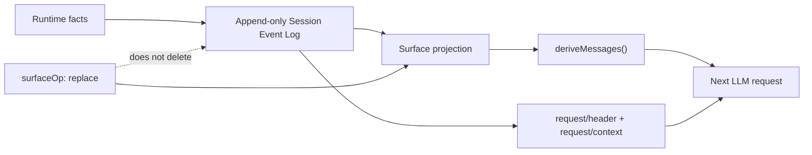

# Session 与状态

Session 是 DSH 的事件溯源事实层。模型看到的历史、Transcript、标题、Telemetry、持久化与多种 Projection 都从 Session Event Log 派生；日志本身保持仅追加，历史重写通过 Surface Projection 表达，而不是删除旧事件。

## 状态主线

## Durable facts 与 Model Surface

Session Event 可以分成两类：

- **Surface Event**：`system/message`、`user/message`、`assistant/message`、`tool/result`，直接参与模型历史派生；
- **Log-only Event**：Turn / Step 边界、Request Header、Attempt、诊断等，只记录运行事实，不直接生成模型 Message。

`session.deriveMessages()` 根据当前 Surface 投影得到模型历史。“Model-visible means logged”意味着任何真正进入模型请求的内容，都必须能够由日志稳定重建。

## 替换不会删除历史

压缩或提示词更新需要改变未来模型看到的上下文时，Session 使用 `surfaceOp: replace` 遮蔽旧 Surface 节点。旧事件仍保留在日志中，因此调试、回放和迁移仍能看到原始事实。

这比直接修改历史数组更重要：模型视图可以演进，但持久事实不可被静默改写。

## Request 状态也可重建

非消息型请求 Envelope 记录在 `request/header`，Provider、Model、Context Window 与系统提示词更新模式等路由信息记录在 `request/context`。模型请求因此不只可以恢复消息，也可以恢复当时使用的调用配置。

## rc.1 的 SessionHandle

rc.1 将持久化写路径改为由生命周期持有的 `SessionHandle`。创建或恢复持久 Session 时，Agent Loop 先取得对应写所有权，再发布可运行 Agent；同一持久 Session 同时至多被一个进程持有写权限。

`ctx.agents.create()` / `resume()` 因此是异步过程。关闭 Agent 时，Session 的收尾事件与持久化缓冲会先完成，再释放 Handle 的写所有权。

## Fork 与恢复

`ctx.sessions.fork()` 从源 Session 的稳定前缀创建子 Session，并保留谱系信息。默认只允许在没有开放 Turn 的边界分支；需要从运行中会话派生时，应裁剪到已完成的稳定前缀。

`ctx.sessions.flush(session)` 是显式持久化屏障：调用完成表示已注册持久化监听器都完成本次刷新，调用方不应假设普通 append 已经同步落盘。

## V3 数据格式

`v0.1.5-rc.1` 使用 Session V3。官方迁移器会从受支持旧日志生成新版日志并保留原文件；迁移后的 Session 不支持降级读取。自定义日志读取器、导出器或分析工具需要按 V3 事件与 Surface 语义适配。
