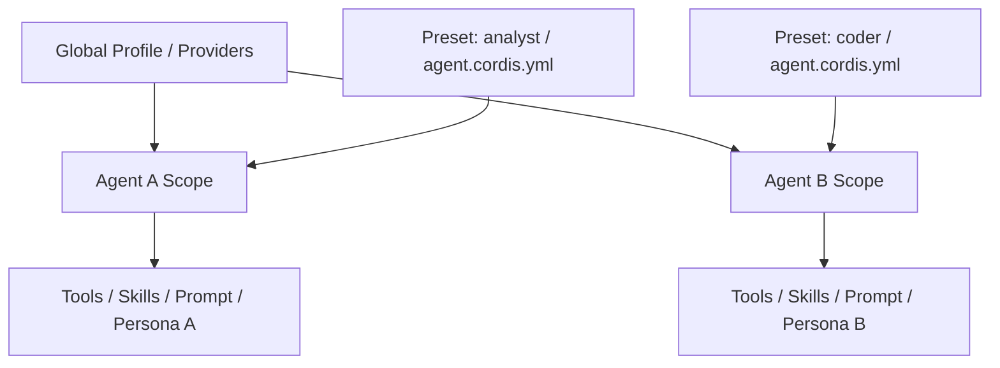

# Preset 与 Agent 组装

Agent Preset 解决“同一个 DSH 进程里，不同 Session 使用不同 Agent 能力集合”的问题。它不是启动 Profile：Profile 决定整个进程装什么，Preset 决定某个 Agent 作用域里启用什么。

## Scope 关系

## Preset 的基本结构

一个 Agent Preset 是一个目录，核心文件为 `agent.cordis.yml`。从该 Preset 创建的 Session 会在自己的 Agent Scope 中挂载对应 Tool、Prompt 段、Skill 与其他插件贡献；同进程其他 Session 保持各自组合。

`agent-presets` 提供 `ctx.agentPresets`，负责 Preset 发现、名单、挂载与创作；`persona` 提供可组合的人设行，使 Preset 可以改变 Agent 身份，而不仅是 Tool 列表。

## Profile 与 Preset 的边界

| 维度 | Profile | Agent Preset |
| --- | --- | --- |
| 生命周期 | 进程启动级 | Agent / Session 级 |
| 作用范围 | 整棵 Plugin Tree | 单个 Agent Scope |
| 典型内容 | Provider、Host、Web、基础能力 | Tool、Skill、Prompt、Persona |
| 是否可多种并存 | 一个进程启动一个 Profile | 一个进程可同时有多个不同 Preset Agent |

需要新增一个全局 FS Provider 时用 Profile；需要某类 Agent 多一个领域 Skill 时用 Preset。

## Scope 如何保证隔离

Preset 挂载发生在 Agent Context 中。Scope 把该 Agent 的注册加入自己的父链，并让对应 Effect 随 Agent 生命周期销毁。因此 Preset 不需要修改全局注册表，也不会因为一个会话启用了某个 Tool 就让全部会话同时获得该 Tool。

## Tool Presentation

Agent 可用能力与模型最终看到的 Tool Schema 不是同一层。Core 中的 Agent Tool Presentation 可以按 Agent 选择如何呈现已注册 Tool，这使 Preset 能够控制模型表面，而不需要复制底层 Tool 实现。

## 适合业务插件的方式

业务产品通常应把“部署级能力”与“角色级能力”拆开：Provider 和基础 Service 放 Profile / Bundle，领域 Tool、Skill、Prompt 和 Persona 放 Preset。这样同一部署可以运行多个业务 Agent，同时共享底层基础设施。
