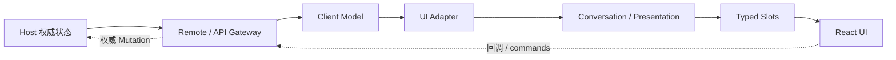

# Web Client 架构

DSH Web Client 自身也是由插件组装的浏览器侧 Cordis 应用。Host 保留权威业务状态，浏览器通过类型化 Remote 构建本地 Model，再由 UI Adapter、Conversation 与 Slots 形成 React 界面。

## 数据通路

官方 Web Client 的依赖方向就是 **Host State → Remote Transport → Client Model → UI Adapter → Conversation / Presentation → Slots → React**。用户操作沿 callback 反向进入 Client Service 或生成的 Remote，再由 Host 完成权威 Mutation，并通过 Stream / Event 回到 Client Model。

## 六个基础设施

| 基础设施 | 负责什么 |
| --- | --- |
| Web Server | HTTP Route、匹配顺序、Fallback Slot 与 Index 渲染挂接点 |
| Client Modules | 根据 `dsh.client` 声明加载浏览器插件图、Bundle Route 与 Boot Graph |
| API Gateway / Typert | 类型化 Host Remote 方法与 Client API 边界 |
| Conversation | 把 Session Event Window 转成 Chat、Trajectory 等 View |
| Session Projection | 从同一 Session Event 序列派生稳定、可订阅的只读切面 |
| Slots | 类型化 React 组合与插件 UI 挂载 |

UI 组件不直接接收 Cordis `ctx`，也不应持有 Transport。运行时 Service 留在插件 `apply` 闭包中，组件只拿经过 Slot 注入的 callback、observable hook 与业务 props。

## Host 与 Client Model

Host Controller 拥有持久化、访问策略、Mutation 顺序与 Stream 生产。Client Model 只是最新可用状态的浏览器投影，需要处理重连、Baseline 替换和增量更新，但不成为第二份业务真相。

Session Client 维护事件窗口、分页、Follow、Queue、Projection 与 Control State；Workspace Client 维护 Workspace 列表与导航状态。React 层通过 UI Adapter 消费这些稳定 Model。

## Conversation 与 Projection

Conversation 不等于 Session Log。它把 target-neutral 的 Session Event 组装为可呈现的 View Node，再由目标 UI Renderer 决定最终视觉形态。Session Projection 则提供另一类纯函数派生：同一事件序列可以生成多个一致快照，并通过变更 Feed 保持客户端状态同步。

这两层都应建立在 Host 的持久事实之上，不应由 React 组件自己重新解释 Session 语义。

## Client Resources 与右侧 Sidebar

rc.1 的 Client Resource Model 使用 `dsh-resource://<type>/…` 地址标识客户端资源，协议 Provider 负责解析资源，`useResource` 等 Hook 管理加载状态、Pin 与 Release。右侧 Sidebar 在这套资源模型之上注册 Tab 类型与导航地址，并通过 `ctx.sidebarRight` 处理导航。

因此，文件预览、Markdown / Code / HTML / PDF / Image 等面板不需要各自再造一套全局状态；资源地址负责“是什么”，Sidebar / Slot 负责“展示在哪里”。

## Slot 模型

`ui-slots` 支持 `single`、`list`、`keyed`、`chain` 四类组合。Slot 声明同时定义 cardinality、scope、owner props 与授权关系；插件通过 `ctx.slots.inject()` 等待目标 Slot 生命周期，再用 `ctx.slots.register()` 贡献 UI。

销毁父 Entry 会递归撤销其 Child Slot 和贡献，UI 扩展因此与 Cordis 生命周期一致，而不是长期残留在全局 React 注册表中。

## rc.1 的全局面板 API

rc.1 新增 root 作用域 keyed `main` Slot，并由 `sidebar.panellist` 提供与主面板 id 对应的入口。原先独立的 Conversation 主区迁移为 `main` 的 `conversation` key，其内部仍保留 Session Header、Composer、Input、Chat 等细粒度 Slot。

这意味着需要新增产品级全局面板时，应注册 `main` + `sidebar.panellist`；需要增强具体会话 Header 或输入区时，则继续进入 `main.conversation` 下的 Conversation Slot，而不是替换整个主区。

## 插件边界

功能插件可以 `import type` 共享声明，但不应运行时导入另一个功能插件的组件或状态。跨功能行为使用 Cordis Service，跨功能 UI 使用 Slot；这条边界是 Web Client 能保持可组合性的基础。
