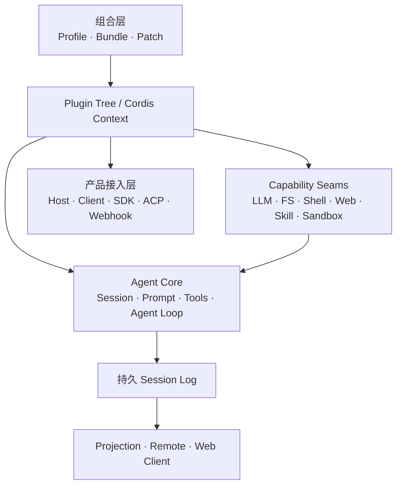

# DSH 全貌

DeepSeek Harness（DSH）是一个开源 Agent Harness。它建立在 Cordis 之上，产品能力通过插件组合形成；模型适配器、Tool Registry、Session Log、Agent Loop 等都处在可替换的插件树中。

> 本页固定于 `dsh-v0.1.5-rc.2`，上游 Commit 为 `fb2c4b9e`。白皮书中的目录、正文、架构图和源码链接均以该版本为准。

## 本白皮书的特点

这套白皮书只使用 DSH 官方源码、官方文档与官方 Release 作为事实依据，不采纳社区二次解释。每个版本是一套完整快照，切换版本时正文、目录、图和源码链接一起切换，不把不同版本内容混在同一页面。

内容按“全貌 → 运行机制 → 模块边界 → 扩展接口 → 源码入口”组织。目标不是复制 API Reference，而是帮助开发者先确定一个能力在 DSH 中属于哪个层、由谁拥有、运行时如何经过它，再进入官方源码。

## 一张图看清 DSH

DSH 的结构可以分成四个面：

| 层 | 负责什么 | 典型模块 |
| --- | --- | --- |
| 组合层 | 决定启动时挂载哪些插件 | Profile、Bundle、Patch、Cordis Context |
| Agent 主干 | 推进一次对话并沉淀持久事实 | Session、System Prompt、Tools、Agent、Agent Loop |
| 能力层 | 向 Agent 提供可替换能力 | LLM、FS、Shell、Terminal、Web、Skill、Subagent、Sandbox |
| 产品层 | 把 Agent 暴露给不同运行形态 | Web、Headless、SDK、ACP |

## 先掌握五个概念

**Plugin** 是组合单位。插件向共享 Context 注册 Service、Event Listener 或 Effect；插件卸载时，对应注册随生命周期撤销。

**Profile** 描述一次 DSH 应用启动使用的组合。该版本随发行版提供 `web`、`headless`、`sdk`、`sdk-minimal`、`acp` 等 Profile 模板。

**Agent** 是运行中的公开句柄。默认驱动由 `agent-loop` 提供，扩展插件面向 `ctx.agents` 与 `Agent` 接口，不直接绑定驱动实现。

**Session Event Log** 是持久事实层。模型历史由日志派生；Turn、Step、用户消息、助手消息与 Tool 结果均围绕这条数据主线组织。当前版本的持久化写路径由生命周期持有的 `SessionHandle` 管理，并通过写所有权避免同一 Session 被多个进程同时恢复写入。

**Capability Seam** 把能力拆成 Definition、Provider、Consumer。Provider 可以在组合层替换，Consumer 依赖稳定接口而不是具体实现。

## 应用如何被组装

运行中的 DSH 是一棵启动时按层叠加得到的 Plugin Tree。官方 `web`、`headless`、`sdk`、`acp` 以 `dsh-base` 为共享基础层，`sdk-minimal` 则拥有一套独立的完整配置树。

配置层按顺序应用：Profile 中的 Bundle → Profile Patch → Harness Home Patch → `--patch` Overlay。更高层可以按配置行覆盖或补充已有组合。

## 推荐阅读路径

第一次阅读建议依次看左侧的五个正文分组：

1. **认识 DSH**：先读“全貌”和“阅读路径与角色入口”。
2. **运行时基础**：连续理解组合、启动、Agent、运行机制和 Session。
3. **编排与能力**：先用“编排方式选择”定位，再分别进入 Subagent、Workflow、Jobs 和 Agent Teams；不要把它们视为同一种异步机制。
4. **产品与扩展**：从 Web Client 和插件边界进入，再按接入方式分别阅读 SDK、ACP 或 Webhook。
5. **生产、边界与演进**：完成安全、观测、可靠性、限制和升级判断。

需要统一术语、文档证据、版本规则或源码入口时，使用“附录与规范”分组，而不是从正文猜测未公开契约。
