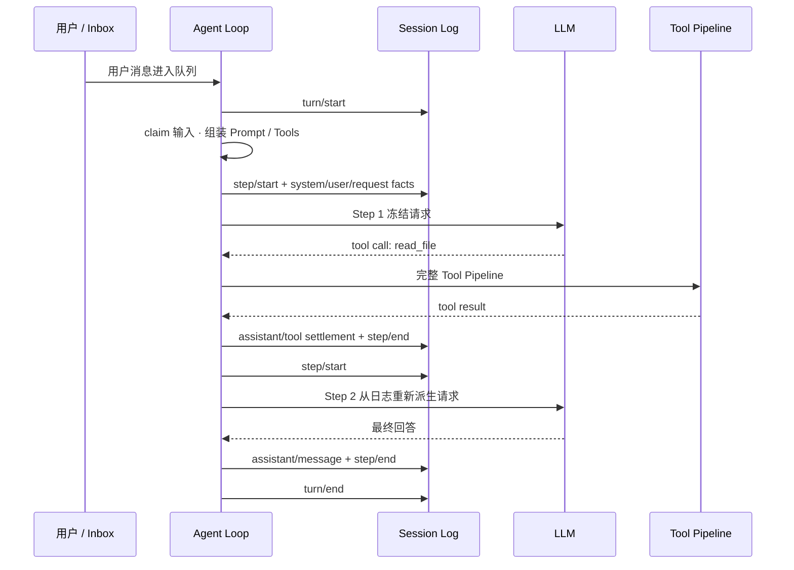

# Agent 运行机制

DSH 把一次连续工作组织为 **Turn**，把一次模型请求及其 Tool Calls 组织为 **Step**。理解运行时的关键不是背事件名，而是知道三个提交边界：**输入何时真正进入历史、模型请求何时冻结、Tool 结果何时成为下一步可见状态**。

## 一个 Turn 到底经历什么

假设用户要求“读取配置文件并解释错误”。模型第一次请求决定调用 `read_file`，Tool 返回内容后，模型第二次请求给出解释。这个过程是一个 Turn、两个 Step：

这解释了为什么一个 Turn 可以有多个 Step：**Tool 不是 Turn 之外的旁路，它的结果会进入同一条 Session 状态主线，并决定是否需要下一次模型请求。**

## 谁拥有哪一段状态

| 对象 | 主要拥有者 | 什么时候写入/变化 | 什么时候结束 |
| --- | --- | --- | --- |
| 待处理输入 | Agent Inbox / 驱动器 | 用户消息、steer 等进入队列 | 被当前 Turn 原子领取 |
| Turn | Agent Loop | `turn/start` 后进入本轮工作 | `turn/end` 提交结束原因 |
| Step | Agent Loop | 每次模型请求前打开 | 模型与 Tool 结算后 `step/end` |
| 模型历史 | Session Event Log 的 Surface Projection | System/User/Assistant/Tool surface 事件提交时 | 不单独拥有；每次请求重新派生 |
| Tool Call | Tool Pipeline | 模型提出调用后进入统一执行链 | 最终 Tool Result 冻结 |
| 持久 Session 写权 | SessionHandle | create/resume 时取得 | Agent teardown 后释放 |

最容易误解的是“模型历史”：DSH 不维护一份独立、可随意修改的 messages 数组作为事实源。真正的持久事实进入 Session Log，下一次请求再从日志派生模型可见历史。

## Step 1：输入不是一进队列就成为历史

Turn 开始后，驱动器先从 Inbox 领取本轮输入，再执行 Prompt、Tool Schema、Runtime Context 组装和 `agent/pre-step`。只有输入真正被本 Step 接纳后，相关 `system/message`、`user/message` 和请求状态才会进入 Session 主线。

这使取消边界更清楚：如果请求准备阶段已经取消，就不应留下“模型从未真正看到、但恢复后却出现在历史里”的半提交输入。

## Step 2：模型请求在 dispatch 前被冻结

一次 Step 的关键顺序是：

1. 记录 `step/start`；
2. 运行 `agent/request` 并解析实际 Provider / Model；
3. 协调 System Prompt 与本 Step 的 User 输入；
4. 从 Session Log 派生消息，并组装 Tool Schemas 与 Request Header；
5. 冻结本次模型请求；
6. 流式调用模型；
7. 结算 Assistant 输出和 Tool Calls；
8. 记录 `step/end`。

请求冻结后，当前 attempt 的输入就不应再被旁路插件悄然修改。需要改变下一次模型看到的内容，应通过公开事件、Prompt/Tool 扩展面或 Session Surface 语义进入下一次派生，而不是修改已经 dispatch 的对象。

## Step 3：Tool Call 会重新进入统一执行流水线

模型返回 Tool Call 后，不是直接执行 `tool.execute()`。它进入：

`tools/pre-execute` → guards → `tools/execute` → `tools/post-execute` → `tools/result`

因此权限、Approval、Hook、Timeout、Telemetry 等横切能力可以参与同一条执行路径。Tool 完成后，调用与结果被结算进 Session；若模型还需要根据结果继续推理，同一 Turn 打开下一个 Step。

这也是为什么扩展 Tool 行为应优先进入 Tool Pipeline，而不是改 Agent Loop：Agent Loop 负责推进 Step，Tool Pipeline 负责执行一项 Tool 能力。

## 什么时候 Turn 结束

出现以下情况时，本 Turn 不再开启新的模型 Step：

- 模型给出最终回答，不再请求 Tool；
- 当前输入被拒绝或取消；
- 运行时错误使本 Turn 无法继续；
- stopping 阶段决定结束当前工作。

Turn 结束原因会作为持久事实记录。一个 Turn 甚至可以没有 Step，例如输入在真正进入模型阶段前已经被取消或拒绝；调试时不能简单假设“有 `turn/start` 就一定有模型请求”。

## 重试为什么不会重新组装全部上下文

真正模型请求前，Agent Loop 已得到一份冻结的请求。Provider 层的重试应围绕这一已准备结果进行，而不是重新跑 Prompt Assembly、`agent/pre-step` 或用户输入准入。

这样可以避免同一 Step 的不同 attempt 因重新执行有副作用的准备逻辑而得到不同输入。失败 attempt 可以作为运行事实保留，但不会伪造成一条成功的模型可见 Assistant Message。

## SessionHandle 为什么属于运行时主链路

持久 Session 的 create / resume 不是“读一个 JSON 文件”那么简单。Agent Loop 在发布可运行 Agent 之前取得 SessionHandle 的写所有权；同一持久 Session 同时至多由一个进程持有写权限。Agent 结束时，收尾与持久化完成后再释放 Handle。

这带来两个直接结论：

- `ctx.agents.create()` / `resume()` 是异步生命周期操作，而不只是对象构造；
- 如果 resume 失败，先检查持久化、写所有权和 Session 生命周期，而不是只看 LLM Provider。

## 失败发生在哪一层

| 失败位置 | 日志/表现 | 是否已经进入模型历史 | 下一步定位 |
| --- | --- | --- | --- |
| Inbox / pre-step 前取消 | Turn 可能无 Step | 否 | 输入领取与取消来源 |
| request / prepareCall 失败 | Step 已打开但模型未 dispatch | 已提交内容取决于失败点 | 路由、Prompt、Provider 准备 |
| 模型流中断 | 可留下 interrupted/attempt 事实 | 只保留已结算的可见前缀 | Provider stream / cancel |
| Tool 被策略拒绝 | Tool Result 为结构化失败 | Tool Call/Result 可成为历史 | Tool Pipeline / Approval / Sandbox |
| Tool timeout / abort | Tool 失败但 Turn 不一定结束 | 失败结果可供模型继续处理 | Tool 本体与超时策略 |
| Session 持久化/Handle 失败 | create/resume/flush/teardown 异常 | 不能假设已可靠落盘 | Persistence / ownership |

这张表是运行时排障的核心：**先判断失败发生在输入、模型、Tool 还是持久化边界，再进入对应子系统。**

## 两条不变量

### Model-visible means logged

真正进入模型请求的上下文必须能由 Session Log 或其已记录请求状态稳定重建。这样 Resume、Fork、Transcript 和调试才不会依赖某个已经消失的进程内隐藏变量。

### 扩展不应越过所有权边界

Prompt 扩展改变 Prompt，Tool 扩展进入 Tool Pipeline，能力 Provider 实现能力，Session/Persistence 管持久事实。为了“方便”直接修改 Agent Loop 内部数组，往往会破坏恢复、重试或审计语义。

## 如何继续阅读

如果你要理解“这些事件如何成为可恢复状态”，继续读 **Session 与状态**；如果你要拦截 Tool，读 **Hooks 与拦截** 和 **安全与权限**；如果你要自己驱动 Agent 生命周期，再进入官方 `packages/core/agent-loop/` 与 `docs/agent-lifecycle.zh.md`。
