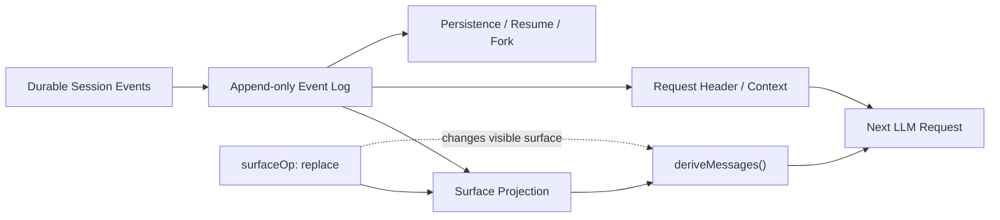

# Session 与状态

Session 解决的不是“把聊天消息存下来”，而是让一次 Agent 工作在**恢复、Fork、重放和调试之后仍能解释当时发生了什么**。它采用事件溯源：Session Event Log 是仅追加事实层，模型历史、标题、Projection 与部分请求状态都从这些事实派生。

## 先看一次真实状态变化

假设用户要求 Agent 读取一个文件，模型调用 Tool，随后系统做上下文压缩，再重启进程恢复会话。DSH 需要同时满足：

1. 能重建用户、Assistant 与 Tool 的模型可见历史；
2. 能知道当时使用了什么模型路由和 Tool Schema；
3. 压缩后模型看到更短历史，但原始事实仍可审计；
4. 重启后得到与持久日志一致的 Surface；
5. 不允许两个进程同时恢复同一个持久 Session 并继续写入。

这就是 Session 设计的核心约束。

## 事实层和视图层必须分开

| 层 | 保存什么 | 谁可以改变它 | 用来做什么 |
| --- | --- | --- | --- |
| Session Event Log | 已发生的持久事实 | 只能 append 新事件 | 恢复、审计、回放、派生 |
| Surface Projection | 当前模型可见节点 | 由事件语义投影 | 生成模型历史 |
| Request Header / Context | 模型请求配置与路由状态 | 由运行时在变化时记录 | 重建当时请求条件 |
| Client Projection | Host / UI 需要的当前视图 | 纯投影与增量通知 | 展示和远端消费 |
| Telemetry | 对外观测记录 | Telemetry Seam / Sink | 诊断和监控，不负责恢复 |

如果把这些层混在一起，就会产生典型错误：把浏览器状态当数据库、把 Telemetry 当恢复依据、把压缩理解成“删除历史”。

## Surface Event 与 Log-only Event

不是所有 Session Event 都会进入模型消息历史。

**Surface Event** 直接参与模型视图，例如 `system/message`、`user/message`、`assistant/message`、`tool/result`。`deriveMessages()` 根据当前 Surface 投影得到下一次请求的消息。

**Log-only Event** 记录运行事实，例如 Turn / Step 边界、失败 attempt、Request Header、Approval 审计或诊断信息。它们可以影响恢复和排障，但不会自动变成一条模型 Message。

这带来一个重要判断：**“写进 Session”不等于“模型会看到”，“模型看到”则必须有可重建的 Session 依据。**

## 一次 Turn 如何落成可恢复事实

以一次包含 Tool 的 Step 为例，持久事实大致沿下面的顺序增长：

1. `turn/start` 标记 Turn 边界；
2. `step/start` 标记一次模型请求开始；
3. System/User Surface 和 Request Header / Context 在 dispatch 前进入日志；
4. 模型产生 Assistant 输出或 Tool Call；
5. Tool 结算后写入 Tool Result；
6. `step/end` 关闭本 Step；
7. 如需继续推理，下一 Step 再从日志派生模型历史；
8. `turn/end` 记录本轮最终结束原因。

恢复时不需要保存一份“运行时 messages 快照”作为第二真源。系统读取持久 Session，重新投影 Surface，并折叠最新请求状态即可得到下一步需要的上下文。

## Replace 为什么不是删除历史

压缩、系统提示词更新等场景需要改变“以后模型看到什么”，但直接删除旧事件会破坏审计和回放。因此 Surface 支持 replacement 语义：新事件通过 `surfaceOp: replace` 改变当前可见节点，旧事件仍留在日志。

可以把它理解为：

- **事实层**回答“过去发生过什么”；
- **Surface**回答“下一次模型现在应该看到什么”。

这两者必须允许不同，否则无法同时做到上下文演进与历史可追踪。

## Request 状态为什么也要记录

只保存消息还不足以复现一次模型请求。Provider、Model、采样/推理配置和 Tool Schemas 属于 Request Header；路由容量、Context Window 与 System Prompt Update 能力属于 Request Context。

运行时只在这些状态发生变化或需要开启新 series 时追加对应记录，恢复时折叠最新状态。这样可以回答“同一段消息当时是用哪个模型、哪些工具、什么路由能力发出去的”，而不是只能看到文本。

## Projection 不拥有事实

Session Projection Seam 用纯函数把 Event Log 投影成 Host、Client 或其他 Consumer 需要的快照。Projection 可以缓存当前状态并发送变化通知，但它不是第二数据库。

这点对 Web Client 尤其重要：浏览器中的 Conversation Model 是消费结果。页面刷新、远端重连或另一种 Client 都应该重新从权威 Session / Projection 链路得到状态，而不是依赖某个浏览器实例保存的隐藏事实。

## SessionHandle：谁可以继续写

持久 Session 的写入还需要解决并发所有权。当前版本由生命周期持有的 `SessionHandle` 管理持久写路径：create / resume 在发布 Agent 之前取得写所有权，同一个持久 Session 同时至多由一个进程继续写入。

| 生命周期阶段 | SessionHandle 的作用 |
| --- | --- |
| Create | 建立持久身份并取得写所有权 |
| Resume | 读取已有日志并以 write 模式重新取得所有权 |
| Running | 持有本 Agent 生命周期内的持久写路径 |
| Flush | 等待已注册持久化监听器完成当前屏障 |
| Close | 完成收尾后释放写所有权 |

因此 `ctx.agents.create()` / `resume()` 是异步生命周期操作。若另一个进程仍持有对应 Session 的写权，不能把第二次恢复当作普通“打开文件”继续写。

## Fork：复制稳定前缀，不共享写入尾部

`ctx.sessions.fork()` 从源 Session 的**稳定前缀**创建子 Session，并记录谱系。默认应在没有开放 Turn 的边界 Fork；若源会话仍在运行，需要裁剪到已经完成的稳定位置。

Fork 后父子拥有各自日志尾部。它适合“从某个已确定历史点探索另一条路线”，不等于两个 Agent 共享同一个可变 Session。

## Flush：`whenIdle()` 不等于已经可靠落盘

普通 append 和 Turn 结束不应被自动理解为同步持久化完成。调用方如果接下来要从外部存储读取、备份或交给另一个进程，应使用显式持久化屏障 `ctx.sessions.flush(session)`。

`flush()` 完成表示已注册的持久化监听器完成本次刷新。这个区别能避免一种很隐蔽的错误：运行时已经 idle，于是调用方立刻读取磁盘，却把仍在缓冲区里的最后一段事件误判为丢失。

## 标题、引用、Telemetry 为什么不是 Session 本体

`session-title` 根据已有消息生成标题快照，并记录标题对应的来源位置；它是可派生/可审计的附加状态，不是模型历史本身。

`session-reference` 用结构化引用表达另一个 Session 的上下文关系，避免把整段历史作为匿名文本复制进当前会话。

Session Telemetry 则把经过分类和脱敏的观测记录发送到外部 Sink。它适合监控，不具备 Session Event Log 的恢复职责。Telemetry 丢失不应改变会话事实，Session Log 也不应为了观测方便无限承载外部监控数据。

## 失败与恢复边界

| 问题 | 真实风险 | 恢复/处理方式 |
| --- | --- | --- |
| 非规范或旧格式 Request Header | 无法可靠重建当前请求状态 | 迁移或拒绝读取，不能静默猜测 |
| 两个进程同时恢复同一 Session | 产生并发写入与顺序歧义 | 由 SessionHandle 写所有权阻止 |
| 在开放 Turn 中随意 Fork | 子 Session 可能继承半完成状态 | 只使用稳定前缀 |
| 只看 Projection 不看 Event Log | 丢失历史事实和失败细节 | 审计/恢复回到 Session Log |
| 把 `whenIdle()` 当持久化完成 | 外部读取可能看到旧状态 | 使用 `flush()` 屏障 |
| 把 Telemetry 当恢复数据 | 观测采样/脱敏后信息并不完整 | 恢复只依赖持久 Session |
| 直接删除旧消息做压缩 | 无法回放原始事实 | 使用 Surface replacement |

## V3 对自定义工具意味着什么

`v0.1.5-rc.2` 使用 Session V3。官方迁移器从受支持的旧日志生成 V3，并保留原文件；迁移后的 Session 不支持直接降级读取。

如果你维护自定义 Session 读取器、导出器、审计工具或数据分析程序，不应只检查“JSON 还能解析”。还需要适配：

- V3 事件词汇与 canonical request envelope；
- Surface replacement 语义；
- Request Header / Context 的折叠方式；
- seed / fork / resume 生命周期边界。

## 排障时先问三个问题

1. **我要找的是事实还是当前视图？**事实看 Event Log，当前模型视图看 Surface / Projection。
2. **问题发生在内存运行还是持久恢复？**运行异常看 Agent Loop；恢复/并发写入看 Persistence 与 SessionHandle。
3. **我要证明“模型看到过”还是“系统记录过”？**前者必须能映射到 Surface，后者可能只是 Log-only Event。

源码阅读建议先从 `docs/subsystems/session.zh.md` 建立事件模型，再进入 `docs/subsystems/session-projection.zh.md` 与 `docs/subsystems/persistence.zh.md`；需要处理升级时最后看 V2 → V3 迁移器。
