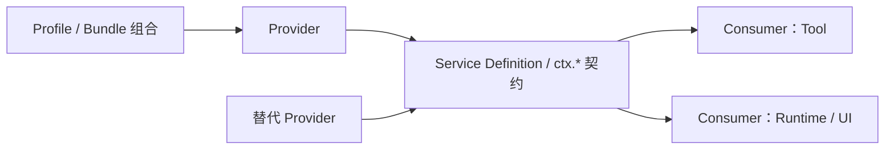

# Capability Seam

Capability Seam 解决的不是“怎么多抽一层接口”，而是**当同一种能力需要被不同部署、Provider 或插件替换时，如何让消费方仍依赖同一个稳定边界**。判断是否应该新增 Seam，关键不是代码量，而是能力是否真的存在可替换实现、独立生命周期和多个 Consumer。

## Seam 结构

这张图里最重要的是依赖方向：**Consumer 依赖 Definition，Provider 实现 Definition，Profile / Bundle 决定实际装配谁**。如果 Consumer 直接知道某个具体 Provider，Seam 就失去了替换价值。

## Definition、Provider、Consumer 分别拥有什么

| 角色 | 拥有的责任 | 不应该拥有 |
| --- | --- | --- |
| Service Definition | `ctx.*` 契约、类型、稳定语义 | 某个平台的实现细节 |
| Provider | 资源、后端连接、平台差异、实现生命周期 | 上层业务流程 |
| Consumer | 基于契约完成 Tool、Runtime、UI 等功能 | 对具体 Provider 的硬编码 |
| Profile / Bundle | 决定本次组合加载哪个 Provider / Consumer | 重新定义 Service 语义 |

官方 Capability Map 会从源码生成 Definition、Provider 与直接 Consumer 的关系。像 `ctx.fs`、`ctx.sandbox`、`ctx.jobs`、`ctx.subagents`、`ctx.workflowEngine` 都可以沿这张图找到定义方、实现方和消费方。

## 一个实际替换场景

假设一个文件 Tool 最初运行在本地，后来需要迁移到远程环境。

正确的边界是：

1. Tool 继续消费 `ctx.fs`；
2. 组合层把 Local FS Provider 换成远程或沙箱化 Provider；
3. 权限和执行隔离继续由各自的 Policy / Sandbox Seam 决定；
4. Tool 本身只处理“读写文件”这个业务动作，不感知远端连接、挂载方式或平台实现。

如果 Tool 直接 import Local FS 包、检查本机路径规则或操作某个 Provider 私有对象，那么所谓“可替换 Provider”实际上只是名义上的。

## 什么时候应该新增 Seam

不要看到两个实现就立刻新增 Service。先回答下面几个问题：

| 判断问题 | 更像 Seam | 更像普通插件内部实现 |
| --- | --- | --- |
| 是否有多个独立 Consumer？ | 是 | 否 |
| 是否需要按部署替换 Provider？ | 是 | 否 |
| Provider 是否拥有独立资源或生命周期？ | 是 | 否 |
| Consumer 是否需要稳定、长期的语义契约？ | 是 | 否 |
| 变化是否只是一个函数内部算法？ | 否 | 是 |

例如“本地 / 远程文件系统”“不同 LLM Adapter”“不同 Sandbox Provider”天然存在部署替换；而一个 Tool 内部的格式化算法通常没有必要单独提升成 `ctx.*` Service。

## Service、Event、Tool 不是三个名字，而是三种权力

| 扩展形态 | 表达什么 | 调用关系 | 适合场景 |
| --- | --- | --- | --- |
| Service | 长期存在、可替换的能力 | Consumer 主动调用 | FS、LLM、Sandbox、Jobs |
| Event / Waterfall | 生命周期中的参与点 | Runtime 分发，插件监听/决策 | 拦截、策略、观测 |
| Tool | 模型可主动选择的动作 | Model → Tool Pipeline | 读文件、执行命令、委派任务 |

同一个功能可以同时经过三层。文件 Tool 是模型可见动作，它调用 `ctx.fs` Service，执行前后又进入 `tools/*` Event 流水线。三层职责不同，不能因为最终都“执行了一段代码”就合并。

## 设计取舍：稳定边界换来组合复杂度

Capability Seam 的收益是替换与复用，但代价也很明确：

- Definition 必须足够稳定，不能把某个 Provider 的私有细节泄漏成公共契约；
- Profile / Bundle 需要承担组合责任，缺 Provider、重复 Provider 或作用域错误会变成装配问题；
- 不同 Provider 可以有不同能力上限，因此 Consumer 不能从“接口名字相同”推导出所有部署保证完全一致；
- Seam 越多，系统的依赖图越重要，否则开发者会知道 `ctx.*` 很多，却不知道真正由谁提供。

所以 Seam 不是“抽象越多越好”，而是把**真正需要替换的能力边界**显式化。

## 常见误用

| 误用 | 后果 | 更合适的处理 |
| --- | --- | --- |
| Consumer 直接依赖具体 Provider 包 | 替换 Provider 时需要改业务代码 | 只依赖 Definition |
| 为单个内部函数创建全局 `ctx.*` | 增加组合和生命周期复杂度 | 保留模块内部实现 |
| 用 Event 充当长期 Service | 状态所有权和调用结果不清晰 | 定义 Service，再用 Event 暴露生命周期点 |
| 用 Tool 作为模块间内部 API | 把模型表面与内部能力耦合 | Tool 作为 Consumer 调 Service |
| 从一个 Provider 推导所有实现都具备相同保证 | 跨平台出现隐式语义差异 | 在 Definition 中写清最低契约，Provider 报告额外能力 |

## 开发新能力时怎么判断

先问“我要新增的是能力、生命周期参与点，还是模型动作”。

- 需要被多个模块调用并可替换：定义或扩展 Service Seam；
- 需要在既有流程中拦截、观察或参与决策：使用 Event / Waterfall；
- 需要让模型主动调用：定义 Tool，并让 Tool 消费已有 Service；
- 只需要替换后端：新增 Provider，不重新定义一套业务接口。

源码定位优先从 `docs/capability-seams.zh.md` 看 Definition / Provider / Consumer 关系，再进入对应 `packages/<group>/README.zh.md` 判断能力边界。