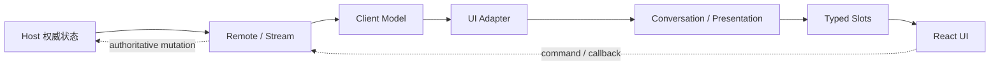

# Web Client 架构

理解 DSH Web Client 的关键，不是记住 React 组件，而是先回答三个问题：**权威状态在哪里、浏览器拿到的是什么、断线以后谁负责恢复**。结论是：Host 拥有业务真相，Client Model 维护可替换的浏览器投影，React 只消费投影并发出命令。

## 六层所有权

| 层 | 主要 owner | 它负责什么 | 不负责什么 |
| --- | --- | --- | --- |
| Host | 业务 Service / Host Controller | 持久化、Mutation 顺序、访问策略、Stream 生产 | React 展示状态 |
| Connection / API Gateway | Transport 与 Remote assembly | request correlation、Remote dispatch、logical stream、取消 | 业务状态真相 |
| Client Model | Session / Workspace Client Model | 浏览器侧 identity、baseline、增量合并、observable snapshot | 最终业务决策 |
| UI Adapter | `ui-session` / `ui-workspace` | 把 Model 转成标准 Slot source / hook | 复制一套业务 store |
| Conversation / Presentation | Conversation target 与功能 UI | 把 Session Event 组装成 Chat / Trajectory 等视图 | 修改 Host 事实 |
| Slots / React | `ui-slots` / renderer / layout | 生命周期组合与最终渲染 | 直接持有 Transport 或 Host Service |

依赖方向始终是：

这条链最重要的约束是：**投影可以被替换，权威状态不能倒置**。浏览器即使暂时保留旧值，也不能因为本地 UI 已更新就假设 Host Mutation 已成功。

## 一次用户操作怎样走完

以“用户在浏览器向当前 Session 发送一条消息”为例：

1. React 组件通过 Slot owner、Adapter 或注入的 Client Service 发出 command；
2. Client Service 调用生成的 Remote method，而不是直接改 Session Event window；
3. Host Controller 校验当前 Session、权限与请求参数，并执行权威 Mutation；
4. 持久 Session 事实进入 Session Log，瞬态控制状态进入对应 Host stream；
5. Remote logical stream 把新 baseline / increment 或 Event 送回浏览器；
6. Client Model 按自身语义合并，必要时替换旧 generation 的 projection；
7. Conversation 根据 Session Event 重新组装 target snapshot；
8. Slot / React 只渲染最新 snapshot。

因此排障时要先判断问题停在哪一层：**command 没发出、Host 没提交、stream 没回来、Client 没合并，还是 UI 没渲染**。不要把所有 Web 问题都归因到 React。

## Remote 与 Stream 不是同一类接口

Typert Remote 适合一次请求—一次结果的命令；Session Event、控制状态与 Workspace 变化则由 logical stream 承载。两者可以复用同一 Connection，但恢复语义不同。

| 数据类型 | 首选机制 | 断线后的恢复方式 |
| --- | --- | --- |
| 一次性业务命令 | Remote method | 调用方根据失败结果决定是否重试 |
| 持久 Session 历史 | `follow()` / `page()` | 新 generation 用 opening snapshot 替换窗口，再按 seq 续接；gap 用 page repair |
| Session control / Workspace state | snapshot stream | 保留最后值，重连后由新 baseline 原子替换 |
| 普通 forwarded notification | event forwarding | 不 replay；错过即错过 |

如果某个领域要求断线后可靠恢复，就必须自己提供 baseline、cursor 或 query；不存在一个全局 `resync()` 能自动恢复所有浏览器状态。

## Client Model 不是第二份业务真相

Session Client 维护事件窗口、分页、Follow、Queue、Projection 与 Control State；Workspace Client 维护 Workspace rows、顺序和导航相关状态。这些对象负责浏览器侧 identity 和竞态合并，但最终 Mutation outcome 仍由 Host 决定。

一个常见错误是让组件在本地 store 中再复制一份 Session / Workspace 状态，然后同时监听 Remote。这样会产生第三套时序：Host、Client Model、Component Store。正确做法是让 UI Adapter 消费既有 Model，领域派生状态进入 Projection / Conversation，而不是在组件里重新实现状态机。

## Conversation 负责“解释事件”，不是拥有事件

Conversation 把持久 Session Event 与实时 Assistant chunk 关联成稳定 Context，再由 Chat、Trajectory 等 target 分别生成自己的 snapshot。聊天气泡只是最终 renderer，不是会话模型本身。

这条边界带来两个直接结果：

- 新增一种 Session 事件展示，应优先考虑 Conversation Definition / target builder，而不是在某个气泡组件里直接扫原始 Event；
- 重连与分页历史必须能经过同一条 Conversation 重放路径，否则实时 UI 与历史 UI 会分叉。

## Slot 决定 UI 生命周期

`ui-slots` 提供 `single`、`list`、`keyed`、`chain` 四种组合形态。注册项归属于 Cordis 生命周期；父 Entry 销毁时，其 Child Slot 与贡献会一起撤销。

当前主区域使用 root-scoped keyed `main` Slot：`conversation` 是主会话 key，`sidebar.panellist` 提供与主面板 id 对应的入口。新增产品级全局面板时，应同时注册主区内容和导航入口；增强现有会话 Header、Composer 或 Chat 时，则进入 `main.conversation` 下的子 Slot。

跨功能 UI 通过 Slot 组合，跨功能行为通过 Cordis Service。功能插件可以 `import type` 共享声明，但不应运行时导入另一个功能插件的组件或状态来建立隐式依赖。

## 一张表定位常见故障

| 症状 | 第一现场 | 权威证据 | 常见错误判断 |
| --- | --- | --- | --- |
| 点击后无动作 | Component callback / Client Service | Remote 调用是否发出 | 先怀疑 Host |
| RPC 成功但界面不变 | Host stream → Client Model | 新 baseline / increment 是否到达并合并 | 直接手动改 React state |
| 重连后数据回退 | logical stream / generation | opening baseline 与 cursor / seq | 把旧本地 snapshot 当真相 |
| Chat 实时正常、刷新后缺失 | Session Event / Conversation replay | 持久 Event 是否存在 | 认为 live chunk 等于持久事实 |
| 插件卸载后 UI 残留 | Slot lifecycle | registration 是否归属正确 scope | 用全局 React registry 绕过 Slot |

## 扩展时怎么选入口

新增 Host 业务能力，先定义 Service / Controller，再通过生成 Remote 或 stream 暴露；新增浏览器领域状态，在 Client Model 中维护；新增 Session 呈现，进入 Conversation；新增布局或面板贡献，进入 Slot。

如果实现需要让 React 组件直接拿 `ctx`、Transport object 或另一个功能插件的内部 store，通常说明边界选错了。继续排查时，从 `docs/subsystems/web-client.zh.md` 的所有权表和数据通路开始，再分别下钻 API Gateway、Client Modules、Conversation 与 Slots。