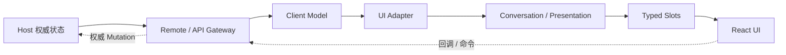

# Web Client 架构

DSH Web Client 自身也是由插件组装的浏览器侧 Cordis 应用。Host 保留权威业务状态，浏览器通过类型化 Remote 构建本地 Model，再由 UI Adapter、Conversation 与 Slots 形成 React 界面。

## 数据通路

官方 Web Client 的依赖方向就是 **Host State → Remote Transport → Client Model → UI Adapter → Conversation / Presentation → Slots → React**。用户操作沿 callback 反向进入 Client Service 或生成的 Remote，再由 Host 完成权威 Mutation，并通过 Stream / Event 回到 Client Model。

## Host、API Gateway 与 Typert

Host 半侧拥有 HTTP 路由、API Gateway 和真正的业务 Mutation。Typert 定义 Remote 描述符、类型图与 Host/Client lookup 契约；构建阶段生成双方约定，运行时通过 Connection 复用 RPC 与 `/api` 路由。

这里要区分两类通路：

- 一元业务调用适合 Typert Remote；
- Session Event、增量数据与其他 Stream 协议可以共用 Connection，但不等于 Remote Method。

因此新增 Web 能力时，不应把所有实时数据都包装成普通 RPC，也不应让浏览器绕过 Host 直接修改权威状态。

## Client Modules：浏览器插件树从哪里来

`client-modules` 负责浏览器插件表与 `dsh.client` 声明。Host 根据当前组合生成 Web Boot Graph，浏览器再按图加载对应 Client 插件与依赖。

这意味着 Web 插件不是一个脱离 Cordis 的 React bundle：它仍然属于版本化的插件组合，Host/Client 两半可以由同一个扩展声明共同参与。

## Client Model 与 Projection

Host Controller 拥有持久化、访问策略、Mutation 顺序与 Stream 生产。Client Model 只是最新可用状态的浏览器投影，需要处理重连、Baseline 替换和增量更新，但不成为第二份业务真相。

Session Client 维护事件窗口、分页、Follow、Queue、Projection 与 Control State；Workspace Client 维护 Workspace 列表与导航状态。React 层通过 UI Adapter 消费这些稳定 Model。

Session Projection Seam 则提供一致的派生快照。UI 应消费 Projection / Model，而不是从原始 Event 数组里到处复制自己的状态机。

## Conversation 是事件到 UI 的组装层

Conversation 子系统把 target-neutral 的 Session Event 组装为 Chat、Trajectory 等 View，并保留 Context Identity、Location Data 与 Replay 路径。具体界面 Renderer 再决定如何展示这些 Render Node。

因此“会话数据模型”和“聊天气泡组件”不是同一层：前者属于 Conversation / Projection，后者属于 UI Presentation。

## Slot 模型

`ui-slots` 支持 `single`、`list`、`keyed`、`chain` 四类组合。Slot 声明同时定义 cardinality、scope、owner props 与授权关系；插件通过 `ctx.slots.inject()` 等待目标 Slot 生命周期，再用 `ctx.slots.register()` 贡献 UI。

销毁父 Entry 会递归撤销其 Child Slot 和贡献，UI 扩展因此与 Cordis 生命周期一致，而不是长期残留在全局 React 注册表中。

## Client Resources 与右侧 Sidebar

Client Resource 使用 `dsh-resource://<type>/...` 地址把“可打开的资源”抽象成统一模型，协议 Provider 负责解析，`useResource` 提供状态、Pin 与 Release 生命周期。

当前版本的右侧 Sidebar 建立在 Resource 与导航模型之上：不同资源类型可以注册 Tab 类型，`ctx.sidebarRight` 负责打开/导航，pane-tab Slot 负责 UI 贡献。Workspace Files 也是该资源模型的具体消费者。

这比“每个插件自己维护一个右侧抽屉”更可组合，也让资源预览、Tab 生命周期和导航行为有统一契约。

## 全局面板 API

当前版本的主区域使用 root 作用域 keyed `main` Slot，并由 `sidebar.panellist` 提供与主面板 id 对应的入口。Conversation 主区是 `main` 的 `conversation` key，其内部仍保留 Session Header、Composer、Input、Chat 等细粒度 Slot。

这意味着需要新增产品级全局面板时，应注册 `main` + `sidebar.panellist`；需要增强具体会话 Header 或输入区时，则继续进入 `main.conversation` 下的 Conversation Slot，而不是替换整个主区。

## rc.2 的 Feedback 与 Deliverables

`ui-message-feedback` 是 Message Feedback 的浏览器 Consumer。rc.2 中好评和差评统一在未记录状态下先打开 `conversation.input.overlay` 中的 Feedback Dialog，确认后通过生成的 Remote 提交；失败会保留草稿并给出提示，已记录评分再次点击则直接撤回。这是 UI/Consumer 行为变化，没有新增 Agent 或 Session 主链路 API。

交付文件相关 UI 在 rc.2 调整了卡片排版、Conversation 间距与代码文件图标。它们仍通过既有 Deliverables / Conversation / Resource / Slot 体系工作，因此自定义插件不需要为 rc.2 迁移 Slot 拓扑，但如果依赖内部 CSS、DOM 或旧图标实现，需要重新核对视觉集成。

## 插件边界

功能插件可以 `import type` 共享声明，但不应运行时导入另一个功能插件的组件或状态。跨功能行为使用 Cordis Service，跨功能 UI 使用 Slot；这条边界是 Web Client 能保持可组合性的基础。

源码定位建议从 `packages/host/`、`packages/api/`、`packages/typert/`、`packages/client/`、`docs/subsystems/web-client.zh.md` 和 `docs/subsystems/slots.zh.md` 进入。
