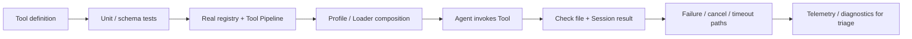

# 可靠性与验证

DSH 的“可靠”不是一个总分，而是**某个具体保证是否有对应证据**。新增 Tool、Session Event、Provider 或 Profile 时，验证对象不同，需要的证据也不同。最危险的做法是用一种绿色结果替代另一种证明，例如“单测通过，所以产品组合一定能启动”。

## 先问：你想证明什么

| 想证明的结论 | 首选证据 | 不能替代它的东西 |
| --- | --- | --- |
| 一个纯函数/边界条件正确 | 单元测试 | e2e 成功一次 |
| 事件顺序、取消、竞态满足契约 | 针对状态与顺序的测试 / invariant | 覆盖率百分比 |
| 一个 Profile 真能被 Loader 组装并启动 | 真实组合测试 | mock Context |
| 持久状态可恢复、可回放 | 写入后重新读取/恢复的场景 | 内存对象断言 |
| 真实模型/外部 Provider 可接入 | 真实 API e2e | stub adapter |
| 用户路径性能没有明显退化 | 对应 benchmark | 功能测试耗时 |
| 线上问题可被定位 | Runtime Invariant + Telemetry + Session 证据 | 多打印几行日志 |

验证的最小单位应该是“一个可反驳的技术结论”，而不是“这个模块看起来有测试”。

## 一条可靠性证据链

以“新增一个会修改文件的 Tool”为例，合理的验证链不是只写一个 `execute()` 单测：

每一层都回答不同问题：

1. **定义层**：参数校验和输出契约是否正确；
2. **流水线层**：Guard、Approval、Timeout、Post-execute 是否真实参与；
3. **组合层**：目标 Profile 是否真的挂载了所需 Service；
4. **Agent 层**：模型可见 Tool Schema 与实际可执行面是否一致；
5. **外部结果层**：文件、Session Event 或远端响应是否真的发生；
6. **失败层**：取消、超时、拒绝、teardown 是否留下正确结果；
7. **诊断层**：失败后能否从 Session / diagnostics / telemetry 定位到责任层。

## 官方验证层次

| 层次 | 回答的问题 | 典型失败 |
| --- | --- | --- |
| 单元测试与覆盖率 | 局部逻辑、错误路径和状态机是否符合预期 | 边界遗漏、非法输入、竞态 |
| Snapshot / golden / replay | 已录制输入和持久结果是否稳定 | 协议或序列化漂移 |
| 真实组合测试 | Loader、Profile、Service 依赖是否能共同工作 | 漏挂插件、注入顺序错误 |
| 真实 API e2e | 实际 Provider / 外部服务链路是否可用 | 鉴权、协议、流式行为差异 |
| Benchmark | 用户关键路径的时间/空间预算是否退化 | 冷启动、长历史、批量事件变慢 |
| Runtime Invariant | 运行期不变量是否被破坏 | 非法状态、生命周期错序 |
| Telemetry / Diagnostics | 失败是否可被外部定位和归因 | 证据缺失、错误层级混淆 |

这些层次是互补关系，不是从“低级测试”升级成“高级测试”后就可以删除前者。

## 改动类型决定最低证据

### 新增公开 Tool / Capability

至少验证：

- 定义、schema 与错误映射；
- 通过真实 Tool Registry / Pipeline 执行，而不是直接调用函数；
- 目标 Profile 中确实可见；
- 成功后检查外部结果或 Session Result；
- 拒绝、取消、超时至少覆盖与契约相关的路径。

### 新增 Session Event 或持久格式

至少验证：

- append 后事件满足不变量；
- 序列化再读取后数据不变；
- Projection / derive 能从日志恢复相同可见状态；
- 旧格式需要迁移时，迁移前后关键语义一致；
- 非法或不兼容格式要明确拒绝，不能静默猜测。

### 修改生命周期 / 并发逻辑

至少验证：

- 正常 start → running → teardown；
- cancel/abort 在关键边界触发；
- 多 owner / 重复 resume / dispose 等冲突路径；
- 完成信号不会早于真正的资源释放或持久化屏障。

### 修改用户关键路径性能

至少验证：

- 使用与真实路径接近的数据规模；
- 记录明确指标和基线；
- 单独解释冷启动、稳态或长历史场景；
- 性能结果不被描述成语义正确性的证据。

## 为什么“Agent 说成功了”不算验证

如果 Agent 执行“写文件”后回复“已经完成”，这只能证明模型生成了这句话。真正的验证必须重新读取文件或由独立外部观察确认结果。

同理：

- 调用 Tool 后检查 Tool Result，不等于文件真的持久存在；
- UI 显示一条消息，不等于 Session Log 可以恢复它；
- Runtime 没抛异常，不等于 teardown 已完成；
- Telemetry 收到事件，不等于持久 Session 已安全落盘。

验证要尽量落在**被测试机制之外的可观察结果**上。

## 失败路径为什么是一等测试对象

Agent Harness 的大量 bug 出现在“半成功”状态：请求已经打开但模型没有 dispatch、Tool 已经启动但收到 abort、Session idle 但持久化还没 flush、Provider 失败后留下了错误的可见历史。

因此针对关键机制，应明确写出：

| 问题 | 测试需要观察什么 |
| --- | --- |
| 取消发生在 dispatch 前 | 不应留下错误的模型可见输入 |
| 模型 stream 中断 | 已结算前缀与失败 attempt 语义正确 |
| Tool 被拒绝 | Tool 主体未执行，结果能定位到策略层 |
| Tool timeout | 取消传播并等待契约要求的停稳 |
| Session flush | 外部重新读取能看到屏障前的全部已提交事实 |
| Provider teardown | 完成信号之后资源确实释放 |

只测 happy path，很难证明这些状态机边界。

## Invariant、Telemetry 与测试各自负责什么

**Invariant** 用于发现“不该存在的运行状态”，适合把结构性契约靠近运行时检查。它不能替代完整场景测试，因为 invariant 通常不知道业务期望结果。

**Telemetry** 用于把运行事实输出到外部观测系统，适合回答“线上发生了什么、责任层在哪里”。它不是 Session 恢复数据，也不能单独证明逻辑正确。

**测试与回放** 用固定输入和可断言结果证明某个行为。对持久系统，重新打开、恢复或从外部读取通常比检查当前内存变量更有价值。

## 发布前按风险检查，而不是按文件检查

发布前可以按下面的顺序审查：

1. **公开契约是否改变？**如果改变，是否有兼容性和迁移证据；
2. **持久事实是否改变？**如果改变，是否有 replay / migration；
3. **所有权或生命周期是否改变？**如果改变，是否覆盖 cancel / teardown / 并发冲突；
4. **真实组合是否改变？**如果改变，是否通过 Loader/Profile 启动；
5. **外部 Provider 是否改变？**如果改变，是否跑真实 API e2e；
6. **性能预算是否改变？**如果改变，是否有对应 benchmark；
7. **线上能否定位？**失败是否能从 Session、Invariant、Diagnostics 和 Telemetry 找到责任层。

这比“改了哪个 package 就跑哪个测试文件”更接近 DSH 的真实系统边界。

## 这些证据仍不能证明什么

即使全部工程验证通过，也不能自动推出：

- 模型在所有开放输入上都能给出正确答案；
- 所有第三方 Provider 都具有相同实现质量；
- 本地 Sandbox 等同于完整虚拟化隔离；
- 一次 benchmark 代表所有机器和部署拓扑；
- Telemetry 完整保存了 Session 可恢复事实。

可靠性文档的价值不是把系统写成“绝对可靠”，而是明确每个保证由哪种证据支撑，以及证据到哪里为止。

官方入口从 `docs/testing.zh.md`、`docs/subsystems/invariants.zh.md`、`packages/runtime-diagnostics/` 与 `docs/subsystems/session-telemetry.zh.md` 进入。
